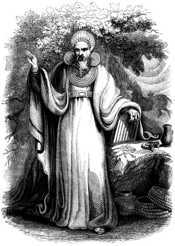

  
[Intangible Textual Heritage](../../../index) 
[Legends/Sagas](../../index)  [Celtic](../index)  [Barddas](../bim) 

------------------------------------------------------------------------

[Buy this Book at
Amazon.com](https://www.amazon.com/exec/obidos/ASIN/1578633079/internetsacredte)

------------------------------------------------------------------------

<table width="75%">
<colgroup>
<col style="width: 50%" />
<col style="width: 50%" />
</colgroup>
<tbody>
<tr class="odd">
<td width="50%" data-valign="TOP"> 
Archdruid in his Full Judicial Costume [19th cent.] (Public Domain Image)</td>
<td width="50%" data-valign="CENTER"><h1 id="the-barddas-of-iolo-morganwg" data-align="CENTER">The Barddas of Iolo Morganwg</h1>
<h2 id="j.-williams-ab-ithel-editor" data-align="CENTER">J. Williams Ab Ithel (editor)</h2>
<h3 id="vol.-ii" data-align="CENTER">Vol. II</h3>
<h4 id="section" data-align="CENTER">[1874]</h4></td>
</tr>
</tbody>
</table>

------------------------------------------------------------------------

[Volume I](../bim1/index)    \|    **Volume II**

------------------------------------------------------------------------

[Contents](#contents)    [Start Reading](bim2000)    [Page
Index](pageidx)   

------------------------------------------------------------------------

|                                                                                                                           |
|---------------------------------------------------------------------------------------------------------------------------|
|  |

This is volume II of the Barddas of Iolo Morganwg. This volume, which
ends abruptly mid-sentence on page 167, is essentially a set of bylaws
for the organization of Welsh Bards. While it does not have the depth
and curious lore of the [first volume](../bim1/index), it is of some
historical interest. This is because Iolo Morganwg was a central founder
of the modern Welsh Gorsedd, the bardic contest which is still held to
this day. This is his vision for how Bardism should be organized and the
high standards to which bards should adhere.

------------------------------------------------------------------------

[Title Page](bim2000)  

### Privilege and Usage

[The Voice of Gorsedd](bim2001)  
[The Triads of Privilege and Usage](bim2002)  
[The Triads of the Bards.--The Triads of Privilege and Usage](bim2003)  
[The Triads of Privilege and Usage](bim2004)  
[The Triads of the Bards of Cymru](bim2005)  
[The Triads of the Bards of the Isle of Britain](bim2006)  
