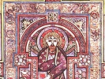

  
[Intangible Textual Heritage](../../../index.md)  [Legends and
Sagas](../../index)  [Celtic](../index)  [Index](index.md) 
[Previous](bok21)  [Next](bok23.md) 

------------------------------------------------------------------------

  
*The Book of Kells*, by Edward Sullivan, \[1920\], at Intangible Textual
Heritage

------------------------------------------------------------------------

PLATE XVIII.

PORTRAIT OF ST. JOHN. FOL. 291 V.

  [  
Click to enlarge](img/pl18.jpg.md)  
Plate XVIII  

(See Introduction, pages 13, 21 and 3 4..)

Note.—This is one of the pages which have
suffered most at the hands of the binder, about one hundred years ago.
(See Prefatory Note to this volume.)

------------------------------------------------------------------------

[Next: Plate XIX. The Opening Words of St. John's Gospel. Fol. 292
R](bok23.md)

