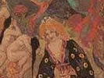

  
[Intangible Textual Heritage](../../../index)  [Legends and
Sagas](../../index)  [Celtic](../index)  [Index](index) 
[Previous](cft01)  [Next](cft03) 

------------------------------------------------------------------------

[Buy this Book at
Amazon.com](https://www.amazon.com/exec/obidos/ASIN/B0027A7X88/internetsacredte)

------------------------------------------------------------------------

  
*Celtic Fairy Tales*, by Joseph Jacobs, \[1892\], at Intangible Textual
Heritage

------------------------------------------------------------------------

p. xiii

# CONTENTS

|         |                                           |                                 |
|---------|-------------------------------------------|---------------------------------|
|         |                                           | PAGE |
| I.      | Connla and the Fairy Maiden               | [1](cft04.htm#page_1)           |
| II\.    | Guleesh                                   | [5](cft05.htm#page_5)           |
| III\.   | The Field of Boliauns                     | [26](cft06.htm#page_26)         |
| IV\.    | The Horned Women                          | [30](cft07.htm#page_30)         |
| V.      | Conall Yellowclaw                         | [34](cft08.htm#page_34)         |
| VI\.    | Hudden and Dudden and Donald O'Neary      | [47](cft09.htm#page_47)         |
| VII\.   | The Shepherd of Myddvai                   | [57](cft10.htm#page_57)         |
| VIII\.  | The Sprightly Tailor                      | [61](cft11.htm#page_61)         |
| IX\.    | The Story of Deidre                       | [65](cft12.htm#page_65)         |
| X.      | Munachar and Manachar                     | [83](cft13.htm#page_83)         |
| XI\.    | Gold-Tree and Silver-Tree                 | [88](cft14.htm#page_88)         |
| XII\.   | King O'Toole and His Goose                | [93](cft15.htm#page_93)         |
| XIII\.  | The Wooing of Olwen                       | [99](cft16.htm#page_99)         |
| XIV\.   | Jack and His Comrades                     | [112](cft17.htm#page_112)       |
|         | p. xiv         |                                 |
|         |                                           | PAGE |
| XV\.    | The Shee an Gannon and the Gruagach Gaire | [121](cft18.htm#page_121)       |
| XVI\.   | The Story Teller at Fault                 | [131](cft19.htm#page_131)       |
| XVII\.  | The Sea Maiden                            | [144](cft20.htm#page_144)       |
| XVIII\. | A Legend of Knockmany                     | [156](cft21.htm#page_156)       |
| XIX\.   | Fair, Brown, and Trembling                | [169](cft22.htm#page_169)       |
| XX\.    | Jack and His Master                       | [182](cft23.htm#page_182)       |
| XXI\.   | Beth Gellert                              | [192](cft24.htm#page_192)       |
| XXII\.  | The Tale of Ivan                          | [195](cft25.htm#page_195)       |
| XXIII\. | Andrew Coffey                             | [200](cft26.htm#page_200)       |
| XXIV\.  | The Battle of the Birds                   | [206](cft27.htm#page_206)       |
| XXV\.   | Brewery of Eggshells                      | [223](cft28.htm#page_223)       |
| XXVI\.  | The Lad with the Goat-skin                | [226](cft29.htm#page_226)       |
|         | Notes and References                      | [237](cft30.htm#page_237)       |

 

------------------------------------------------------------------------

[Next: Full Page Illustrations](cft03)
