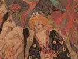

  
[Intangible Textual Heritage](../../../index.md)  [Legends and
Sagas](../../index)  [Celtic](../index)  [Index](index.md) 
[Previous](cft02)  [Next](cft04.md) 

------------------------------------------------------------------------

[Buy this Book at
Amazon.com](https://www.amazon.com/exec/obidos/ASIN/B0027A7X88/internetsacredte.md)

------------------------------------------------------------------------

  
*Celtic Fairy Tales*, by Joseph Jacobs, \[1892\], at Intangible Textual
Heritage

------------------------------------------------------------------------

p. xv

# Full-Page Illustrations

|                                |                                         |
|--------------------------------|-----------------------------------------|
| The Sea-Maiden                 | [frontispiece](cft00.htm#img_front.md)     |
| Connla and the Fairy Maiden    | *To face page* [2](cft04.htm#img_00200.md) |
| Conal Yellowclaw               | " [42](cft08.htm#img_04200.md)             |
| Deirdre                        | " [68](cft12.htm#img_06800.md)             |
| The Eagle of Ebbw Abwy         | " [109](cft16.htm#img_10900.md)            |
| "Trembling" at the Church Door | " [172](cft22.htm#img_17200.md)            |
| Thatching with Bird's Feathers | " [214](cft27.htm#img_21400.md)            |
| Caution to Readers             | " [236](cft29.htm#img_23600.md)            |

 

------------------------------------------------------------------------

[Next: Connla and the Fairy Maiden](cft04.md)
