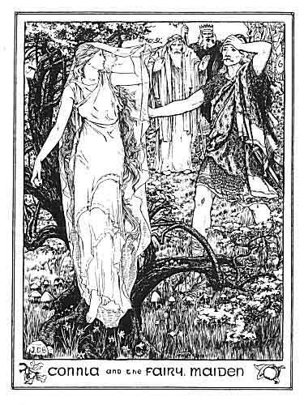

  
[Intangible Textual Heritage](../../../index)  [Legends and
Sagas](../../index)  [Celtic](../index)  [Index](index) 
[Previous](cft03)  [Next](cft05) 

------------------------------------------------------------------------

[Buy this Book at
Amazon.com](https://www.amazon.com/exec/obidos/ASIN/B0027A7X88/internetsacredte)

------------------------------------------------------------------------

  
*Celtic Fairy Tales*, by Joseph Jacobs, \[1892\], at Intangible Textual
Heritage

------------------------------------------------------------------------

p. 1

# Connla and the Fairy Maiden

|                    |
|--------------------|
|  |

CONNLA of the Fiery Hair was son of Conn of the Hundred Fights. One day
as he stood by the side of his father on the height of Usna, he saw a
maiden clad in strange attire coming towards him.

"Whence comest thou, maiden?" said Connla.

"I come from the Plains of the Ever Living," she said, "there where
there is neither death nor sin. There we keep holiday alway, nor need we
help from any in our joy. And in all our pleasure we have no strife. And
because we have our homes in the round green hills, men call us the Hill
Folk."

The king and ail with him wondered much to hear a voice when they saw no
one. For save Connla alone, none saw the Fairy Maiden.

"To whom art thou talking, my son? " said Conn the king.

Then the maiden answered, "Connla speaks to a young, fair maid, whom
neither death nor old age awaits. I love Connla, and now I call him away
to the Plain of Pleasure,

p. 2

\[paragraph continues\] Moy Mell, where
Boadag is king for aye, nor has there been complaint or sorrow in that
land since he has held the kingship. Oh, come with me, Connla of the
Fiery Hair, ruddy as the dawn with thy tawny skin. A fairy crown awaits
thee to grace thy comely face and royal form. Come, and never shall thy
comeliness fade, nor thy youth, till the last awful day of judgment."

The king in fear at what the maiden said, which he heard though he could
not see her, called aloud to his Druid, Coran by name.

"Oh, Coran of the many spells," he said, " and of the cunning magic, I
call upon thy aid. A task is upon me too great for all my skill and wit,
greater than any laid upon me since I seized the kingship. A maiden
unseen has met us, and by her power would take from me my dear, my
comely son. If thou help not, he will be taken from thy king by woman's
wiles and witchery."

Then Coran the Druid stood forth and chanted his spells towards the spot
where the maiden's voice had been heard. And none heard her voice again,
nor could Connla see her longer. Only as she vanished before the Druid's
mighty spell, she threw an apple to Connla.

For a whole month from that day Connla would take nothing, either to eat
or to drink, save only from that apple. But as he ate it grew again and
always kept whole. And all the while there grew within him a mighty
yearning and longing after the maiden he had seen.

But when the last day of the month of waiting came, Connla stood by the
side of the king his father on the Plain of Arcomin, and again he saw
the maiden come towards him, and again she spoke to him.

   
The Sea-Maiden

p. 3

"’Tis a glorious place, forsooth, that Connla holds among shortlived
mortals awaiting the day of death. But now the folk of life, the
ever-living ones, beg and bid thee come to Moy Mell, the Plain of
Pleasure, for they have learnt to know thee, seeing thee in thy home
among thy dear ones.

When Conn the king heard the maiden's voice he called to his men aloud
and said:

"Summon swift my Druid Coran, for I see she has again this day the power
of speech."

Then the maiden said " Oh, mighty Conn, fighter of a hundred fights, the
Druid's power is little loved; it has little honour in the mighty land,
peopled with so many of the upright. When the Law will come, it will do
away with the Druid's magic spells that come from the lips of the false
black demon."

Then Conn the king observed that since the maiden came Connla his son
spoke to none that spake to him. So Conn of the hundred fights said to
him, "Is it to thy mind what the woman says, my son?"

"’Tis hard upon me," then said Connla; "I love my own folk above all
things; but yet, but yet a longing seizes me for the maiden."

When the maiden heard this, she answered and said "The ocean is not so
strong as the waves of thy longing. Come with me in my curragh, the
gleaming, straight-gliding crystal canoe. Soon we can reach Boadag's
realm. I see the bright sun sink, yet far as it is, we can reach it
before dark. There is, too, another land worthy of thy journey, a land
joyous to all that seek it. Only wives and maidens dwell there. If thou
wilt, we can seek it and live there alone together in joy."

p. 4

When the maiden ceased to speak, Connla of the Fiery Hair rushed away
from them and sprang into the curragh, the gleaming, straight-gliding
crystal canoe. And then they all, king and court, saw it glide away over
the bright sea towards the setting sun. Away and away, till eye could
see it no longer, and Connla and the Fairy Maiden went their way on the
sea, and were no more seen, nor did any know where they came.

------------------------------------------------------------------------

[Next: Guleesh](cft05)
