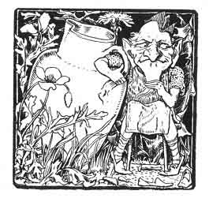
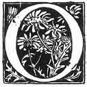

  
[Intangible Textual Heritage](../../../index)  [Legends and
Sagas](../../index)  [Celtic](../index)  [Index](index) 
[Previous](cft05)  [Next](cft07) 

------------------------------------------------------------------------

[Buy this Book at
Amazon.com](https://www.amazon.com/exec/obidos/ASIN/B0027A7X88/internetsacredte)

------------------------------------------------------------------------

  
*Celtic Fairy Tales*, by Joseph Jacobs, \[1892\], at Intangible Textual
Heritage

------------------------------------------------------------------------

p. 26

# The Field of Boliauns

 

|                    |
|--------------------|
|  |

ONE fine day in harvest—it was indeed Lady-day in harvest, that
everybody knows to be one of the greatest holidays in the year—Tom
Fitzpatrick was taking a ramble through the ground, and went along the
sunny side of a hedge; when all of a sudden he heard a clacking sort of
noise a little before him in the hedge. "Dear me," said Tom, "but isn't
it surprising to hear the stonechatters singing so late in the season?"
So Tom stole on, going on the tops of his toes to try if he could get a
sight of what was making the noise, to see if he was right in his guess.
The noise stopped; but as Tom looked sharply through the bushes, what
should he see in a nook of the hedge but a brown pitcher, that might
hold about a gallon and a half of liquor; and by-and-by a little wee
teeny tiny bit of an old man, with a little *motty* of a cocked hat
stuck upon the top

p. 27

of his head, a deeshy daushy leather apron hanging before him, pulled
out a little wooden stool, and stood up upon it, and dipped a little
piggin into the pitcher, and took out the full of it, and put it beside
the stool, and then sat down under the pitcher, and began to work at
putting a heel-piece on a bit of a brogue just fit for himself. "Well,
by the powers," said Tom to himself, "I often heard tell of the
Lepracauns, and, to tell God's truth, I never rightly believed in
them—but here's one of them in real earnest. If I go knowingly to work,
I'm a made man. They say a body must never take their eyes off them, or
they'll escape.

Tom now stole on a little further, with his eye fixed on the little man
just as a cat does with a mouse. So when he got up quite close to him,
"God bless your work, neighbour," said Tom.

The little man raised up his head, and "Thank you kindly," said he.

"I wonder you'd be working on the holiday!" said Tom.

"That's my own business, not yours," was the reply.

"Well, may be you'd be civil enough to tell *us* what you've got in the
pitcher there?" said Tom.

"That I will, with pleasure,'' said he; ''it's good beer."

"Beer!" said Tom. "Thunder and fire! where did you get it?"

"Where did I get it, is it? Why, I made it. And what do you think I made
it of?"

"Devil a one of me knows,'' said Tom; but of malt, I suppose, what
else?"

"There you're out. I made it of heath."

"Of heath!" said Tom, bursting out laughing; "sure you don't think me to
be such a fool as to believe that?"

p. 28

"Do as you please," said he, "but what I tell you is the truth. Did you
never hear tell of the Danes."

"Well, what about *them?"* said Tom.

"Why, all the about them there is, is that when they were here they
taught us to make beer out of the heath, and the secret's in my family
ever since."

"Will you give a body a taste of your beer?" said Tom.

"I'll tell you what it is, young man, it would be fitter for you to be
looking after your father's property than to be bothering decent quiet
people with your foolish questions. There now, while you're idling away
your time here, there's the cows have broke into the oats, and are
knocking the corn all about."

Tom was taken so by surprise with this that he was just on the very
point of turning round when he recollected himself; so, afraid that the
like might happen again, he made a grab at the Lepracaun, and caught him
up in his hand; but in his hurry he overset the pitcher, and spilt all
the beer, so that he could not get a taste of it to tell what sort it
was. He then swore that he would kill him if he did not show him where
his money was. Tom looked so wicked and so bloody-minded that the little
man was quite frightened; so says he, "Come along with me a couple of
fields off, and I'll show you a crock of gold."

So they went, and Tom held the Lepracaun fast in his hand, and never
took his eyes from off him, though they had to cross hedges and ditches,
and a crooked bit of bog, till at last they came to a great field all
full of boliauns, and the Lepracaun pointed to a big boliaun, and says
he, "Dig under that boliaun, and you'll get the great crock all full of
guineas."

p. 29

Tom in his hurry had never thought of bringing a spade with him, so he
made up his mind to run home and fetch one; and that he might know the
place again he took off one of his red garters, and tied it round the
boliaun.

Then he said to the Lepracaun, "Swear ye'll not take that garter away
from that boliaun." And the Lepracaun swore right away not to touch it.

"I suppose," said the Lepracaun, very civilly, "you have no further
occasion for me?"

"No," says Tom; "you may go away now, if you please, and God speed you,
and may good luck attend you wherever you go."

"Well, good-bye to you, Tom Fitzpatrick," said the Lepracaun; "and much
good may it do you when you get it."

So Tom ran for dear life, till he came home and got a spade, and then
away with him, as hard as he could go, back to the field of boliauns;
but when he got there, lo and behold! not a boliaun in the field but had
a red garter, the very model of his own, tied about it; and as to
digging up the whole field, that was all nonsense, for there were more
than forty good Irish acres in it. So Tom came home again with his spade
on his shoulder, a little cooler than he went, and many's the hearty
curse he gave the Lepracaun every time he thought of the neat turn he
had served him.

------------------------------------------------------------------------

[Next: The Horned Women](cft07)
