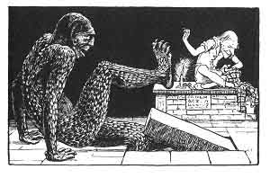
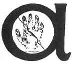

  
[Intangible Textual Heritage](../../../index.md)  [Legends and
Sagas](../../index)  [Celtic](../index)  [Index](index.md) 
[Previous](cft10)  [Next](cft12.md) 

------------------------------------------------------------------------

[Buy this Book at
Amazon.com](https://www.amazon.com/exec/obidos/ASIN/B0027A7X88/internetsacredte.md)

------------------------------------------------------------------------

  
*Celtic Fairy Tales*, by Joseph Jacobs, \[1892\], at Intangible Textual
Heritage

------------------------------------------------------------------------

p. 61

# The Sprightly Tailor

 

|                    |
|--------------------|
|  |

A SPRIGHTLY tailor was employed by the great Macdonald, in his castle at
Saddell, in order to make the laird a pair of trews, used in olden time.
And trews being the vest and breeches united in one piece, and
ornamented with fringes, were very comfortable, and suitable to be worn
in walking or dancing. And Macdonald had said to the tailor, that if he
would make the trews by night in the church, he would get a handsome
reward. For it was thought that the old ruined church was haunted, and
that fearsome things were to be seen there at night.

The tailor was well aware of this; but he was a sprightly man, and when
the laird dared him to make the trews by

p. 62

night in the church, the tailor was not to be daunted, but took it in
hand to gain the prize. So, when night came, away he went up the glen,
about half a mile distance from the castle, till he came to the old
church. Then he chose him a nice gravestone for a seat and he lighted
his candle, and put on his thimble, and set to work at the trews plying
his needle nimbly, and thinking about the hire that the laird would have
to give him.

For some time he got on pretty well, until he felt the floor all of a
tremble under his feet; and looking about him, but keeping his fingers
at work, he saw the appearance of a great human head rising up through
the stone pavement of the church. And when the head had risen above the
surface, there came from it a great, great voice. And the voice said: "
Do you see this great head of mine?"

"I see that, but I'll sew this!" replied the sprightly tailor; and he
stitched away at the trews.

Then the head rose higher up through the pavement, until its neck
appeared. And when its neck was shown, the thundering voice came again
and said: "Do you see this great neck of mine?"

"I see that, but I'll sew this!" said the sprightly tailor and he
stitched away at his trews.

Then the head and neck rose higher still, until the great shoulders and
chest were shown above the ground. And again the mighty voice thundered:
"Do you see this great chest of mine?"

And again the sprightly tailor replied: "I see that, but I'll sew this!"
and stitched away at his trews.

And still it kept rising through the pavement, until it

p. 63

shook a great pair of arms in the tailor's face, and said Do you see
these great arms of mine?"

"I see those, but I'll sew this! " answered the tailor; and he stitched
hard at his trews, for he knew that he had no time to lose.

The sprightly tailor was taking the long stitches, when he saw it
gradually rising and rising through the floor, until it lifted out a
great leg, and stamping with it upon the pavement, said in a roaring
voice "Do you see this great leg of mine?"

"Aye, aye: I see that, but I'll sew this!" cried the tailor; and his
fingers flew with the needle, and he took such long stitches, that he
was just come to the end of the trews, when it was taking up its other
leg. But before it could pull it out of the pavement, the sprightly
tailor had finished his task; and, blowing out his candle, and springing
from off his gravestone, he buckled up, and ran out of the church with
the trews under his arm. Then the fearsome thing gave a loud roar, and
stamped with both his feet upon the pavement, and out of the church he
went after the sprightly tailor.

Down the glen they ran, faster than the stream when the flood rides it;
but the tailor had got the start and a nimble pair of legs, and he did
not choose to lose the laird's reward. And though the thing roared to
him to stop, yet the sprightly tailor was not the man to be beholden to
a monster. So he held his trews tight, and let no darkness grow under
his feet, until he had reached Saddell Castle. He had no sooner got
inside the gate, and shut it, than the apparition came up to it; and,
enraged at losing his prize, struck the wall above the gate, and left
there the mark of

p. 64

his five great fingers. Ye may see them plainly to this day, if ye'll
only peer close enough.

But the sprightly tailor gained his reward: for Macdonald paid him
handsomely for the trews, and never discovered that a few of the
stitches were somewhat long.

------------------------------------------------------------------------

[Next: The Story of Deirdre](cft12.md)
