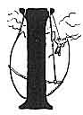

  
[Intangible Textual Heritage](../../../index.md)  [Legends and
Sagas](../../index)  [Celtic](../index)  [Index](index.md) 
[Previous](cft27)  [Next](cft29.md) 

------------------------------------------------------------------------

[Buy this Book at
Amazon.com](https://www.amazon.com/exec/obidos/ASIN/B0027A7X88/internetsacredte.md)

------------------------------------------------------------------------

  
*Celtic Fairy Tales*, by Joseph Jacobs, \[1892\], at Intangible Textual
Heritage

------------------------------------------------------------------------

p. 223

 

# Brewery of Eggshells

|                    |
|--------------------|
|  |

IN Treneglwys there is a certain shepherd's cot known by the name of Twt
y Cymrws because of the strange strife that occurred there. There once
lived there a man and his wife, and they had twins whom the woman nursed
tenderly. One day she was called away to the house of a neighbour at
some distance. She did not much like going and leaving her little ones

p. 224

all alone in a solitary house, especially as she had heard tell of the
good folk haunting the neighbourhood.

Well, she went and came back as soon as she could, but on her way back
she was frightened to see some old elves of the blue petticoat crossing
her path though it was midday. She rushed home, but found her two little
ones in the cradle and everything seemed as it was before.

But after a time the good people began to suspect that something was
wrong, for the twins didn't grow at all.

The man said: "They're not ours."

The woman said: "Whose else should they be?"

And so arose the great strife so that the neighbours named the cottage
after it. It made the woman very sad, so one evening she made up her
mind to go and see the Wise Man of Llanidloes, for he knew everything
and would advise her what to do.

So she went to Llanidloes and told the case to the Wise Man. Now there
was soon to be a harvest of rye and oats, so the Wise Man said to her,
"When you are getting dinner for the reapers, clear out the shell of a
hen's egg and boil some potage in it, and then take it to the door as if
you meant it as a dinner for the reapers. Then listen if the twins say
anything. If you hear them speaking of things beyond the understanding
of children, go back and take them up and throw them into the waters of
Lake Elvyn. But if you don't hear anything remarkable, do them no
injury."

So when the day of the reap came the woman did all that the Wise Man
ordered, and put the eggshell on the fire and took it off and carried it
to the door, and there she stood

p. 225

and listened. Then she heard one of the children say to the other:

Acorn before oak I knew,  
An egg before a hen,  
But I never heard of an eggshell brew  
A dinner for harvest men.

So she went back into the house, seized the children and threw them into
the Llyn, and the goblins in their blue trousers came and saved their
dwarfs and the mother had her own children back and so the great strife
ended.

------------------------------------------------------------------------

[Next: The Lad with the Goat-Skin](cft29.md)
