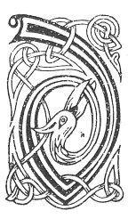

  
[Intangible Textual Heritage](../../../index.md) 
[Legends/Sagas](../../index)  [Celtic](../index.md)  [Carmina
Gadelica](../cg)  [Index](index)  [Previous](cg1006)  [Next](cg1008.md) 

------------------------------------------------------------------------

[Buy this Book at
Amazon.com](https://www.amazon.com/exec/obidos/ASIN/B0027P88YQ/internetsacredte.md)

------------------------------------------------------------------------

  
*Carmina Gadelica, Volume 1*, by Alexander Carmicheal, \[1900\], at
Intangible Textual Heritage

------------------------------------------------------------------------

 

<table data-border="0">
<colgroup>
<col style="width: 50%" />
<col style="width: 50%" />
</colgroup>
<tbody>
<tr class="odd">
<td data-valign="top" width="327">
p. 12
</td>
<td data-valign="top" width="327">
p. 13
</td>
</tr>
<tr class="even">
<td data-valign="top" width="327"><h3 id="achanaidh-choitcheann-4" data-align="center">ACHANAIDH CHOITCHEANN [4]</h3></td>
<td data-valign="top" width="327"><h3 id="a-general-supplication" data-align="center">A GENERAL SUPPLICATION</h3></td>
</tr>
</tbody>
</table>

 

<table data-border="0">
<colgroup>
<col style="width: 25%" />
<col style="width: 25%" />
<col style="width: 25%" />
<col style="width: 25%" />
</colgroup>
<tbody>
<tr class="odd">
<td data-valign="top">
 
</td>
<td data-valign="top">
p. 12
</td>
<td data-valign="top">
 
</td>
<td data-valign="top">
p. 13
</td>
</tr>
<tr class="even">
<td data-valign="top">
 
</td>
<td data-valign="top">
DHE, eisd ri m’ urnuigh, 
Lub rium do chluas, 
Leig m’ achan agus m’ urnuigh. 
T' ionnsuidh a suas. 
Thig, a Righ na glorach 
Da m’ chomhnadh a nuas, 
A Righ na bith ’s na trocair, 
Le comhnadh an Uain, 
A Mhic na Muire Oighe 
Da m’ chomhnadh le buadh, 
A Mhic na Muire mine 
Is finne-ghile snuadh.
</td>
<td data-valign="top">
 
</td>
<td data-valign="top">
GOD, listen to my prayer, 
Bend to me Thine ear, 
Let my supplications and my prayers 
Ascend to Thee upwards, 
Come, Thou King of Glory, 
To protect me down, 
Thou King of life and mercy 
With the aid of the Lamb. 
Thou Son of Mary Virgin 
To protect me with power, 
Thou Son of the lovely Mary 
Of purest fairest beauty.
</td>
</tr>
</tbody>
</table>

 

 

------------------------------------------------------------------------

[Next: 5. God Be With Us. Dhe Bi Maille Ruinn](cg1008.md)
