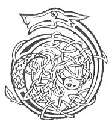

  
[Intangible Textual Heritage](../../../index.md) 
[Legends/Sagas](../../index)  [Celtic](../index.md)  [Carmina
Gadelica](../cg)  [Index](index)  [Previous](cg1007)  [Next](cg1009.md) 

------------------------------------------------------------------------

[Buy this Book at
Amazon.com](https://www.amazon.com/exec/obidos/ASIN/B0027P88YQ/internetsacredte.md)

------------------------------------------------------------------------

  
*Carmina Gadelica, Volume 1*, by Alexander Carmicheal, \[1900\], at
Intangible Textual Heritage

------------------------------------------------------------------------

 

<table data-border="0">
<colgroup>
<col style="width: 50%" />
<col style="width: 50%" />
</colgroup>
<tbody>
<tr class="odd">
<td data-valign="top" width="327">
p. 14
</td>
<td data-valign="top" width="327">
p. 15
</td>
</tr>
<tr class="even">
<td data-valign="top" width="327"><h3 id="dhe-bi-maille-ruinn-5" data-align="center">DHE BI MAILLE RUINN [5]</h3></td>
<td data-valign="top" width="327"><h3 id="god-be-with-us" data-align="center">GOD BE WITH US</h3></td>
</tr>
</tbody>
</table>

 

THE three poems which follow were obtained from Dr Donald Munro Morrison
in 1889, a few days before he died. Dr Morrison heard them from an old
man known as 'Coinneach Saor'--Kenneth the Carpenter--and his wife, at
Obbe, Harris. These aged people were habitually practising quaint
religious ceremonies and singing curious religious poems to peculiar
music, evidently ancient. In childhood Dr Morrison lived much with this
couple, and in manhood recorded much of their old lore and music. These
however he noted in characters and notations of his own invention which
he did not live to render intelligible to others. This is extremely
regrettable, as Dr Morrison's wonderfully wide, accurate, and p. 15 scientific attainments, deep knowledge of
Gaelic, of music, and of acoustics, were only surpassed by his native
modesty of mind and tender benevolence of heart. He was a distinguished
medallist in several subjects at the University of Edinburgh.

A Gaelic proverb says: 'Theid dualchas an aghaidh nan creag'--Heredity
will go against the rocks. Dr Morrison was descended from the famous
hereditary brehons of the Isles. These Morrisons have been celebrated
throughout the centuries for their wit, poetry, music, philosophy,
medicine and science, for their independence of mind and sobriety of
judgment, and for their benevolence of heart and unfailing hospitality.

<table data-border="0">
<colgroup>
<col style="width: 25%" />
<col style="width: 25%" />
<col style="width: 25%" />
<col style="width: 25%" />
</colgroup>
<tbody>
<tr class="odd">
<td data-valign="top">
 
</td>
<td data-valign="top">
p. 14
</td>
<td data-valign="top">
 
</td>
<td data-valign="top">
p. 15
</td>
</tr>
<tr class="even">
<td data-valign="top">
 
</td>
<td data-valign="top">
DHE bi maille ruinn 
Air an la an diugh, 
                  Amen. 
[Dhe bi maille ruinn 
Air an oidhche nochd, 
                  Amen.] 
Ruinn agus leinn 
Air an la an diugh, 
Amen. 
[Ruinn agus leinn 
Air an oidhche nochd, 
                  Amen.] 
Tha e soilleir duinn ri leirsinn, 
Bho thaine sinn chon an t-saoghail, 
Gu robh sinn toillteanach air t’ fhearg. 
                  Amen. 
O t’ fhearg fein 
A Dhe nan dul, 
                  Amen. 
Tabhair mathanas duinn, 
                  Amen.
</td>
<td data-valign="top">
 
</td>
<td data-valign="top">
GOD be with us 
On this Thy day, 
                  Amen. 
[God be with us 
On this Thy night, 
                  Amen.] 
To us and with us, 
On this Thy day, 
                  Amen. 
[To us and with us, 
On this Thy night, 
                  Amen.] 
It is clear to be seen of us, 
Since we came into the world, 
That we have deserved Thy wrath, 
                  Amen. 
O Thine own wrath, 
Thou God of all, 
                  Amen. 
Grant us forgiveness, 
                  Amen.
</td>
</tr>
<tr class="odd">
<td data-valign="top">
 
</td>
<td data-valign="top">
p. 16
</td>
<td data-valign="top">
 
</td>
<td data-valign="top">
p. 17
</td>
</tr>
<tr class="even">
<td data-valign="top">
 
</td>
<td data-valign="top">
Tabhair mathanas duinn, 
                  Amen. 
Tabhair duinn do mhathanas fein 
A Dhe mheinich nan dul, 
                  Amen. 
Ni sam bith is dona duinn, 
No thogas fianuis ’n ar n-aghaidh 
Far am faide am bi sinn, 
Suabharaich thus oirnn e, 
Duabharaich thus oirnn e, 
Fuadaich fein uainn e, 
Agus ruaig as ar cridheachan, 
Duthainn, suthainn, sior, 
     Duthainn, suthainn, sior. 
                  Amen.
</td>
<td data-valign="top">
 
</td>
<td data-valign="top">
Grant us forgiveness, 
                  Amen. 
Grant to us Thine own forgiveness, 
Thou merciful God of all, 
                  Amen. 
Anything that is evil to us, 
Or that may witness against us 
Where we shall longest be, 
Illume it to us, 
Obscure it to us, 
Banish it from us, 
Root it out of our hearts, 
Ever, evermore, everlastingly. 
     Ever, evermore, everlastingly. 
                  Amen.
</td>
</tr>
</tbody>
</table>

 

 

------------------------------------------------------------------------

[Next: 6. Jesu, Thou Son of Mary. Ios, a Mhic Muire](cg1009.md)
