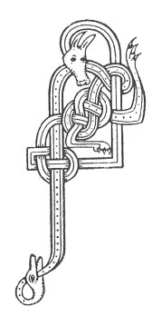

  
[Intangible Textual Heritage](../../../index) 
[Legends/Sagas](../../index)  [Celtic](../index)  [Carmina
Gadelica](../cg)  [Index](index)  [Previous](cg1010)  [Next](cg1012) 

------------------------------------------------------------------------

[Buy this Book at
Amazon.com](https://www.amazon.com/exec/obidos/ASIN/B0027P88YQ/internetsacredte)

------------------------------------------------------------------------

  
*Carmina Gadelica, Volume 1*, by Alexander Carmicheal, \[1900\], at
Intangible Textual Heritage

------------------------------------------------------------------------

 

<table data-border="0">
<colgroup>
<col style="width: 50%" />
<col style="width: 50%" />
</colgroup>
<tbody>
<tr class="odd">
<td data-valign="top" width="327">
p. 26
</td>
<td data-valign="top" width="327">
p. 27
</td>
</tr>
<tr class="even">
<td data-valign="top" width="327"><h3 id="uirnigh-8" data-align="center">UIRNIGH [8]</h3></td>
<td data-valign="top" width="327"><h3 id="a-prayer" data-align="center">A PRAYER</h3></td>
</tr>
</tbody>
</table>

 

<table data-border="0">
<colgroup>
<col style="width: 25%" />
<col style="width: 25%" />
<col style="width: 25%" />
<col style="width: 25%" />
</colgroup>
<tbody>
<tr class="odd">
<td data-valign="top">
 
</td>
<td data-valign="top">
p. 26
</td>
<td data-valign="top">
 
</td>
<td data-valign="top">
p. 27
</td>
</tr>
<tr class="even">
<td data-valign="top">
 
</td>
<td data-valign="top">
    A DHIA, 
Ann mo ghniamh, 
Ann mo bhriathar, 
Ann mo mhiann, 
Ann mo chiall, 
Ann an riarachd mo chail, 
Ann mo shuain, 
Ann mo bhruail, 
Ann mo chluain, 
Ann mo smuain, 
Ann mo chridh agus m’anam a ghnath, 
Biodh an Oigh bheannaichte, Moire, 
Agus Ogan geallaidh na glorach a tamh, 
    O ann mo chridh agus m'anam a ghnath, 
    Biodh an Oigh bheannaichte, Moire, 
    Agus Ogan cubhraidh na glorach a tamh.
</td>
<td data-valign="top">
 
</td>
<td data-valign="top">
    O God, 
In my deeds, 
In my words, 
In my wishes, 
In my reason, 
And in the fulfilling of my desires, 
In my sleep, 
In my dreams, 
In my repose. 
In my thoughts, 
In my heart and soul always, 
May the blessed Virgin Mary, 
And the promised Branch of Glory dwell, 
    Oh! in my heart and soul always, 
    May the blessed Virgin Mary, 
    And the fragrant Branch of Glory dwell.
</td>
</tr>
</tbody>
</table>

 

 

------------------------------------------------------------------------

[Next: 9. Rune of the 'Muthairn.' Duan Na Muthairn](cg1012)
