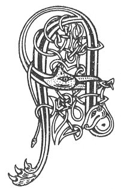

  
[Intangible Textual Heritage](../../../index.md) 
[Legends/Sagas](../../index)  [Celtic](../index.md)  [Carmina
Gadelica](../cg)  [Index](index)  [Previous](cg1011)  [Next](cg1013.md) 

------------------------------------------------------------------------

[Buy this Book at
Amazon.com](https://www.amazon.com/exec/obidos/ASIN/B0027P88YQ/internetsacredte.md)

------------------------------------------------------------------------

  
*Carmina Gadelica, Volume 1*, by Alexander Carmicheal, \[1900\], at
Intangible Textual Heritage

------------------------------------------------------------------------

 

<table data-border="0">
<colgroup>
<col style="width: 50%" />
<col style="width: 50%" />
</colgroup>
<tbody>
<tr class="odd">
<td data-valign="top" width="327">
p. 28
</td>
<td data-valign="top" width="327">
p. 29
</td>
</tr>
<tr class="even">
<td data-valign="top" width="327"><h3 id="duan-na-muthairn-9" data-align="center">DUAN NA MUTHAIRN [9]</h3></td>
<td data-valign="top" width="327"><h3 id="rune-of-the-muthairn" data-align="center">RUNE OF THE 'MUTHAIRN'</h3></td>
</tr>
</tbody>
</table>

 

<table data-border="0">
<colgroup>
<col style="width: 25%" />
<col style="width: 25%" />
<col style="width: 25%" />
<col style="width: 25%" />
</colgroup>
<tbody>
<tr class="odd">
<td data-valign="top">
 
</td>
<td data-valign="top">
p. 28
</td>
<td data-valign="top">
 
</td>
<td data-valign="top">
p. 29
</td>
</tr>
<tr class="even">
<td data-valign="top">
 
</td>
<td data-valign="top">
A RIGH na gile, 
A Righ na greine, 
A Righ na rinne, 
A Righ na reula, 
A Righ na cruinne, 
A Righ na speura, 
Is aluinn do ghnuis, 
A lub eibhinn.

Da lub shioda 
Shios ri d’ leasraich 
Mhinich, chraicich; 
Usgannan buidhe 
Agus dolach 
As gach sath dhiubh
</td>
<td data-valign="top">
 
</td>
<td data-valign="top">
THOU King of the moon, 
Thou King of the sun, 
Thou King of the planets, 
Thou King of the stars, 
Thou King of the globe, 
Thou King of the sky, 
Oh! lovely Thy countenance, 
Thou beauteous Beam.

Two loops of silk 
Down by thy limbs, 
Smooth-skinned; 
Yellow jewels 
And a handful 
Out of every stock of them.
</td>
</tr>
</tbody>
</table>

 

------------------------------------------------------------------------

[Next: 10. Bless, O Chief of Generous Chiefs. Beannaich, a Thriath Nam
Flath Fial](cg1013.md)
