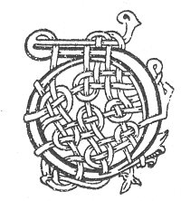

  
[Intangible Textual Heritage](../../../index.md) 
[Legends/Sagas](../../index)  [Celtic](../index.md)  [Carmina
Gadelica](../cg)  [Index](index)  [Previous](cg1013)  [Next](cg1015.md) 

------------------------------------------------------------------------

[Buy this Book at
Amazon.com](https://www.amazon.com/exec/obidos/ASIN/B0027P88YQ/internetsacredte.md)

------------------------------------------------------------------------

  
*Carmina Gadelica, Volume 1*, by Alexander Carmicheal, \[1900\], at
Intangible Textual Heritage

------------------------------------------------------------------------

 

<table data-border="0">
<colgroup>
<col style="width: 50%" />
<col style="width: 50%" />
</colgroup>
<tbody>
<tr class="odd">
<td data-valign="top" width="327">
p. 32
</td>
<td data-valign="top" width="327">
p. 33
</td>
</tr>
<tr class="even">
<td data-valign="top" width="327"><h3 id="solus-iuil-na-siorruidheachd-11" data-align="center">SOLUS-IUIL NA SIORRUIDHEACHD [11]</h3></td>
<td data-valign="top" width="327"><h3 id="the-guiding-light-of-eternity" data-align="center">THE GUIDING LIGHT OF ETERNITY</h3></td>
</tr>
</tbody>
</table>

 

<table data-border="0">
<colgroup>
<col style="width: 25%" />
<col style="width: 25%" />
<col style="width: 25%" />
<col style="width: 25%" />
</colgroup>
<tbody>
<tr class="odd">
<td data-valign="top">
 
</td>
<td data-valign="top">
p. 32
</td>
<td data-valign="top">
 
</td>
<td data-valign="top">
p. 33
</td>
</tr>
<tr class="even">
<td data-valign="top">
 
</td>
<td data-valign="top">
DHE, thug mis a fois na h-oidhch an raoir 
Chon solus aoibh an la an diugh, 
Bi da mo thoir bho sholus ur an la an diugh, 
Chon solus iul na siorruidheachd, 
     O! bho sholus ur an la an diugh, 
     Gu solus iul na siorruidheachd.
</td>
<td data-valign="top">
 
</td>
<td data-valign="top">
O GOD, who broughtst me from the rest of last night 
Unto the joyous light of this day, 
Be Thou bringing me from the new light of this day 
Unto the guiding light of eternity. 
     Oh! from the new light of this day 
     Unto the guiding light of eternity.
</td>
</tr>
</tbody>
</table>

 

 

------------------------------------------------------------------------

[Next: 12. A Prayer For Grace. Achanaidh Grais](cg1015.md)
