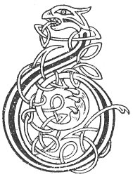

  
[Intangible Textual Heritage](../../../index.md) 
[Legends/Sagas](../../index)  [Celtic](../index.md)  [Carmina
Gadelica](../cg)  [Index](index)  [Previous](cg1015)  [Next](cg1017.md) 

------------------------------------------------------------------------

[Buy this Book at
Amazon.com](https://www.amazon.com/exec/obidos/ASIN/B0027P88YQ/internetsacredte.md)

------------------------------------------------------------------------

  
*Carmina Gadelica, Volume 1*, by Alexander Carmicheal, \[1900\], at
Intangible Textual Heritage

------------------------------------------------------------------------

 

<table data-border="0">
<colgroup>
<col style="width: 50%" />
<col style="width: 50%" />
</colgroup>
<tbody>
<tr class="odd">
<td data-valign="top" width="327">
p. 36
</td>
<td data-valign="top" width="327">
p. 37
</td>
</tr>
<tr class="even">
<td data-valign="top" width="327"><h3 id="achanaidh-comhnadh-13" data-align="center">ACHANAIDH COMHNADH [13]</h3></td>
<td data-valign="top" width="327"><h3 id="prayer-for-protection" data-align="center">PRAYER FOR PROTECTION</h3></td>
</tr>
</tbody>
</table>

 

<table data-border="0">
<colgroup>
<col style="width: 25%" />
<col style="width: 25%" />
<col style="width: 25%" />
<col style="width: 25%" />
</colgroup>
<tbody>
<tr class="odd">
<td data-valign="top">
 
</td>
<td data-valign="top">
p. 36
</td>
<td data-valign="top">
 
</td>
<td data-valign="top">
p. 37
</td>
</tr>
<tr class="even">
<td data-valign="top">
 
</td>
<td data-valign="top">
BHO is tu is Buachiaill thar an treuid 
Iomain fein shin do chleidh ’s do chaimir, 
Seun sinn fo do bhrot riomhach reidh; 
      A Sgeith dhidinn, dion ri ’r mairionn.

Bi-sa do chlaidheamh cruaidh, cosgarra, 
Chon sinne dhion a irinn arrais, 
Bho fhigeirich is bho fheadaine frinne fuara, 
      ’S bho dheathach ruadh an aigeil.

M’ anam an urrachd an Ard Righ, 
Micheil murrach an comhdhail m’ anama.
</td>
<td data-valign="top">
 
</td>
<td data-valign="top">
As Thou art the Shepherd over the flock 
Tend Thou us to the cot and the fold, 
Sain us beneath Thine own glorious mantle; 
      Thou Shield of protection, guard us for ever,

Be Thou a hard triumphant slave 
To shield us securely from wicked hell, 
From the fiends and from the stieve snell gullies, 
      And from the lurid smoke of the abyss.

Be my soul in the trustance of the High King, 
Be Michael the powerful meeting my soul.
</td>
</tr>
</tbody>
</table>

 

 

------------------------------------------------------------------------

[Next: 14. Jesu Who Ought to be Praised. Eosai Bu Choir a
Mholadh](cg1017.md)
