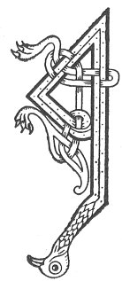

  
[Intangible Textual Heritage](../../../index) 
[Legends/Sagas](../../index)  [Celtic](../index)  [Carmina
Gadelica](../cg)  [Index](index)  [Previous](cg1017)  [Next](cg1019) 

------------------------------------------------------------------------

[Buy this Book at
Amazon.com](https://www.amazon.com/exec/obidos/ASIN/B0027P88YQ/internetsacredte)

------------------------------------------------------------------------

  
*Carmina Gadelica, Volume 1*, by Alexander Carmicheal, \[1900\], at
Intangible Textual Heritage

------------------------------------------------------------------------

 

<table data-border="0">
<colgroup>
<col style="width: 50%" />
<col style="width: 50%" />
</colgroup>
<tbody>
<tr class="odd">
<td data-valign="top" width="327">
p. 42
</td>
<td data-valign="top" width="327">
p. 43
</td>
</tr>
<tr class="even">
<td data-valign="top" width="327"><h3 id="carraig-nan-al-15" data-align="center">CARRAIG NAN AL [15]</h3></td>
<td data-valign="top" width="327"><h3 id="the-rock-of-rocks" data-align="center">THE ROCK OF ROCKS</h3></td>
</tr>
</tbody>
</table>

 

THE old man from whom this piece was taken down said
that in his boyhood innumerable hymns and fragments of hymns of this
nature were common throughout the isles of p.
43 Barra. When strangers began to come in they derided the old
people and their old lore and their old ways, and the younger
generations neglected the ways of their fathers, alike the questionably
and the unquestionably good.

 

<table data-border="0">
<colgroup>
<col style="width: 25%" />
<col style="width: 25%" />
<col style="width: 25%" />
<col style="width: 25%" />
</colgroup>
<tbody>
<tr class="odd">
<td data-valign="top">
 
</td>
<td data-valign="top">
p. 42
</td>
<td data-valign="top">
 
</td>
<td data-valign="top">
p. 43
</td>
</tr>
<tr class="even">
<td data-valign="top">
 
</td>
<td data-valign="top">
AIR Carraig nan al, 
Sith Pheadail is Phail, 
Sheumais is Eoin na baigh, 
Is na lan ionraic Oigh, 
     Na lan ionraic Oigh.

Sith Athar an aigh, 
Sith Chriosda na pais, 
Sith Spiorad nan gras, 
Duinn fein is do ’n al ta og, 
     Duinn fein is do ’n al ta og.
</td>
<td data-valign="top">
 
</td>
<td data-valign="top">
ON the Rock of rocks, 
The peace of Peter and Paul, 
Of James and John the beloved, 
And of the pure perfect Virgin, 
     The pure perfect Virgin.

The peace of the Father of joy, 
The peace of the Christ of pasch, 
The peace of the Spirit of grace, 
To ourselves and to our children, 
    Ourselves and our children.
</td>
</tr>
</tbody>
</table>

 

------------------------------------------------------------------------

[Next: 16. The Lightener of the Stars. Sorchar Nan Reul](cg1019)
