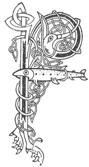

  
[Intangible Textual Heritage](../../../index) 
[Legends/Sagas](../../index)  [Celtic](../index)  [Carmina
Gadelica](../cg)  [Index](index)  [Previous](cg1018)  [Next](cg1020) 

------------------------------------------------------------------------

[Buy this Book at
Amazon.com](https://www.amazon.com/exec/obidos/ASIN/B0027P88YQ/internetsacredte)

------------------------------------------------------------------------

  
*Carmina Gadelica, Volume 1*, by Alexander Carmicheal, \[1900\], at
Intangible Textual Heritage

------------------------------------------------------------------------

 

<table data-border="0">
<colgroup>
<col style="width: 50%" />
<col style="width: 50%" />
</colgroup>
<tbody>
<tr class="odd">
<td data-valign="top" width="327">
p. 44
</td>
<td data-valign="top" width="327">
p. 45
</td>
</tr>
<tr class="even">
<td data-valign="top" width="327"><h3 id="sorchar-nan-reul-16" data-align="center">SORCHAR NAN REUL [16]</h3></td>
<td data-valign="top" width="327"><h3 id="the-lightener-of-the-stars" data-align="center">THE LIGHTENER OF THE STARS</h3></td>
</tr>
</tbody>
</table>

 

 

<table data-border="0">
<colgroup>
<col style="width: 25%" />
<col style="width: 25%" />
<col style="width: 25%" />
<col style="width: 25%" />
</colgroup>
<tbody>
<tr class="odd">
<td data-valign="top">
 
</td>
<td data-valign="top">
p. 44
</td>
<td data-valign="top">
 
</td>
<td data-valign="top">
p. 45
</td>
</tr>
<tr class="even">
<td data-valign="top">
 
</td>
<td data-valign="top">
FEUCH Sorchar nan reul 
Air corbha nan neul, 
Agus ceolradh nan speur 
     Ri luaidh dha.

Tighinn le caithrim a nuas 
Bho an Athair tha shuas, 
Clar agus farcha nan duan 
     Ri seirm dha.

Chriosd, a chomairc mo ruin 
Corn nach togainn do chliu! 
Ainglich is naomhaich chiuil 
     Ri luaidh dhut.

A Mhic Mhoire nam buadh, 
Is fire finne-ghile snuadh, 
Liom bu shon a bhi an cluan 
     Do shaoibhreis.

A Chriosda mo chaoimhe, 
A Chriosda Chro-naoimhe, 
Bithim gach la agus oidhche 
     Ri luaidh ort.
</td>
<td data-valign="top">
 
</td>
<td data-valign="top">
BEHOLD the Lightener of the stars 
On the crests of the clouds, 
And the choralists of the sky 
     Lauding Him.

Coming down with acclaim 
From the Father above, 
Harp and lyre of song 
     Sounding to Him.

Christ, Thou refuge of my love, 
Why should not I raise Thy fame! 
Angels and saints melodious 
     Singing to Thee.

Thou Son of the Mary of graces, 
Of exceeding white purity of beauty, 
Joy were it to me to be in the fields 
     Of Thy riches.

O Christ my beloved, 
O Christ of the Holy Blood, 
By day and by night 
     I praise Thee.
</td>
</tr>
</tbody>
</table>

 

 

------------------------------------------------------------------------

[Next: 17 The Cross of the Saints and the Angels. Crois Nan Naomh Agus
Nan Aingeal](cg1020)
