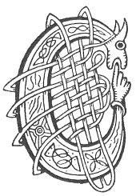

  
[Intangible Textual Heritage](../../../index.md) 
[Legends/Sagas](../../index)  [Celtic](../index.md)  [Carmina
Gadelica](../cg)  [Index](index)  [Previous](cg1019)  [Next](cg1021.md) 

------------------------------------------------------------------------

[Buy this Book at
Amazon.com](https://www.amazon.com/exec/obidos/ASIN/B0027P88YQ/internetsacredte.md)

------------------------------------------------------------------------

  
*Carmina Gadelica, Volume 1*, by Alexander Carmicheal, \[1900\], at
Intangible Textual Heritage

------------------------------------------------------------------------

 

<table data-border="0">
<colgroup>
<col style="width: 50%" />
<col style="width: 50%" />
</colgroup>
<tbody>
<tr class="odd">
<td data-valign="top" width="327">
p. 46
</td>
<td data-valign="top" width="327">
p. 47
</td>
</tr>
<tr class="even">
<td data-valign="top" width="327"><h3 id="crois-nan-naomh-agus-nan-aingeal-17" data-align="center">CROIS NAN NAOMH AGUS NAN AINGEAL [17]</h3></td>
<td data-valign="top" width="327"><h3 id="the-cross-of-the-saints-and-the-angels" data-align="center">THE CROSS OF THE SAINTS AND THE ANGELS</h3></td>
</tr>
</tbody>
</table>

 

 

<table data-border="0">
<colgroup>
<col style="width: 25%" />
<col style="width: 25%" />
<col style="width: 25%" />
<col style="width: 25%" />
</colgroup>
<tbody>
<tr class="odd">
<td data-valign="top">
 
</td>
<td data-valign="top">
p. 46
</td>
<td data-valign="top">
 
</td>
<td data-valign="top">
p. 47
</td>
</tr>
<tr class="even">
<td data-valign="top">
 
</td>
<td data-valign="top">
CROIS nan naomh agus nan aingeal liom 
Bho fhrois m’ aodain gu faobhar mo bhonn.

   *       *       *       *       *       *

A Mhicheil mhil, a Mhoire ghlorach, 
A Bhride mhin nan dualan orach, 
Dionaibh mi ’s a cholunn bhronach, 
Dionadh tri mi air sligh via corach. 
     O! tri mi air sligh na corach.

Dionaibh mi ’s a choich-anama bhochd, 
Dionaibh mi ’s mi cho diblidh nochd, 
Dionaibh mi air sligh gun lochd, 
Dionadh tri air mo thi a nochd. 
     O! tri air mo thi a nochd.
</td>
<td data-valign="top">
 
</td>
<td data-valign="top">
THE cross of the saints and of the angels with me 
From the top of my face to the edge of my soles.

   *       *       *       *       *       *

O Michael mild, O Mary of glory, 
O gentle Bride of the locks of gold, 
Preserve ye me in the weakly body, 
The three preserve me on the just path. 
     Oh! three preserve me on the just path.

Preserve ye me in the soul-shrine poor, 
Preserve ye me, and I so weak and naked, 
Preserve ye me without offence on the way, 
The preservation of the three upon me to-night. 
     Oh! the three to shield me to-night.
</td>
</tr>
</tbody>
</table>

 

 

------------------------------------------------------------------------

[Next: 18. The Guardian Angel. An T-Aingheal Diona](cg1021.md)
