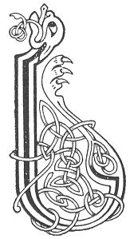

  
[Intangible Textual Heritage](../../../index.md) 
[Legends/Sagas](../../index)  [Celtic](../index.md)  [Carmina
Gadelica](../cg)  [Index](index)  [Previous](cg1021)  [Next](cg1023.md) 

------------------------------------------------------------------------

[Buy this Book at
Amazon.com](https://www.amazon.com/exec/obidos/ASIN/B0027P88YQ/internetsacredte.md)

------------------------------------------------------------------------

  
*Carmina Gadelica, Volume 1*, by Alexander Carmicheal, \[1900\], at
Intangible Textual Heritage

------------------------------------------------------------------------

<table data-border="0">
<colgroup>
<col style="width: 50%" />
<col style="width: 50%" />
</colgroup>
<tbody>
<tr class="odd">
<td data-valign="top" width="327">
p. 50
</td>
<td data-valign="top" width="327">
p. 51
</td>
</tr>
<tr class="even">
<td data-valign="top" width="327"><h3 id="ruin-19" data-align="center">RUIN [19]</h3></td>
<td data-valign="top" width="327"><h3 id="desires" data-align="center">DESIRES</h3></td>
</tr>
</tbody>
</table>

 

 

<table data-border="0">
<colgroup>
<col style="width: 25%" />
<col style="width: 25%" />
<col style="width: 25%" />
<col style="width: 25%" />
</colgroup>
<tbody>
<tr class="odd">
<td data-valign="top">
 
</td>
<td data-valign="top">
p. 50
</td>
<td data-valign="top">
 
</td>
<td data-valign="top">
p. 51
</td>
</tr>
<tr class="even">
<td data-valign="top">
 
</td>
<td data-valign="top">
LABHRAM gach la a reir do cheartais, 
Gach la taisbim do smachd, a Dhe; 
Labhram gach la a reir do reachd-sa, 
Gach la is oidhche bithim toigh riut fein.

Gach la cunntam fath do throcair, 
Toirim gach la dha do nosda speis; 
Gach la tionnsgam fein dhut oran, 
Teillim gach la do ghloir, a Dhe.

Beirim gach la gaol dhut, Iosa, 
Gach oidhche nithim da reir; 
Gach la ’s oidhche, duar is soillse, 
Luaidhim do chaoibhneas dhomh, a Dhe.
</td>
<td data-valign="top">
 
</td>
<td data-valign="top">
MAY I speak each day according to Thy justice, 
Each day may I show Thy chastening, O God; 
May I speak each day according to Thy wisdom, 
Each day and night may I be at peace with Thee.

Each day may I count the causes of Thy mercy, 
May I each day give heed to Thy laws; 
Each day may I compose to Thee a song, 
May I harp each day Thy praise, O God.

May I each day give love to Thee, Jesu, 
Each night may I do the same; 
Each day and night, dark and light, 
May I laud Thy goodness to me, O God.
</td>
</tr>
</tbody>
</table>

 

 

------------------------------------------------------------------------

[Next: 20. Invocation For Justice. Ora Ceartais](cg1023.md)
