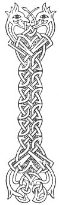

  
[Intangible Textual Heritage](../../../index.md) 
[Legends/Sagas](../../index)  [Celtic](../index.md)  [Carmina
Gadelica](../cg)  [Index](index)  [Previous](cg1022)  [Next](cg1024.md) 

------------------------------------------------------------------------

[Buy this Book at
Amazon.com](https://www.amazon.com/exec/obidos/ASIN/B0027P88YQ/internetsacredte.md)

------------------------------------------------------------------------

  
*Carmina Gadelica, Volume 1*, by Alexander Carmicheal, \[1900\], at
Intangible Textual Heritage

------------------------------------------------------------------------

<table data-border="0">
<colgroup>
<col style="width: 50%" />
<col style="width: 50%" />
</colgroup>
<tbody>
<tr class="odd">
<td data-valign="top" width="327">
p. 52
</td>
<td data-valign="top" width="327">
p. 53
</td>
</tr>
<tr class="even">
<td data-valign="top" width="327"><h3 id="ora-ceartais-20" data-align="center">ORA CEARTAIS [20]</h3></td>
<td data-valign="top" width="327"><h3 id="invocation-for-justice" data-align="center">INVOCATION FOR JUSTICE</h3></td>
</tr>
</tbody>
</table>

 

PROVERBS anent law and justice abound in Gaelic, as:--'Is cam agus is
direach an lagh':--Crooked and straight is the law. Bheir buidire breith
ach co bheir ceartas?'--A witling may give judgment, but who will give
justice? 'Colach ri ceart a mhadaidh-ruaidh, lugach, liugach,
lamalach'--Like the justice of the fox, crooked, cunning, corrupt.

The administration of law and justice throughout the Highlands and
Islands before the abolition of heritable jurisdictions was
inadequate--men being too often appointed to administer justice not from
their fitness but from their influence. Probably the feeling of distrust
engendered by this absence of even-handed justice evoked these poems
from the consciousness of the people and led them to appeal their cause
to a Higher Court.

The litigant went at morning dawn to a place where three streams met.
And as the rising sun gilded the mountain crests, the man placed his two
palms edgeways together and filled them with water from the junction of
the streams. Dipping his face into this improvised basin, he fervently
repeated the prayer, p. 53 after which he made
his way to the court, feeling strong in the justice of his cause. On
entering the court and on looking round the room, the applicant for
justice mentally, sometimes in an undertone, said

<table data-border="0">
<colgroup>
<col style="width: 33%" />
<col style="width: 33%" />
<col style="width: 33%" />
</colgroup>
<tbody>
<tr class="odd">
<td data-valign="top">
'Dhe, seun an teach 
Bho steidh gu fraigh; 
M’ fheart os cinn gach neach, 
Feart gach neach fo m’ thraigh.'
</td>
<td data-valign="top">
 
</td>
<td data-valign="top">
God sain the house 
From site to summit; 
My word above every person, 
The word of every person below my foot.
</td>
</tr>
</tbody>
</table>

The ceremonies observed in saying these prayers for
justice, like those observed on many similar occasions, are symbolic.
The bathing represents purification; the junction of three streams, the
union of the Three Persons of the Godhead; and the spreading rays of the
morning sun, divine grace. The deer is symbolic of wariness, the horse
of strength, the serpent of wisdom, and the king of dignity.

 

<table data-border="0">
<colgroup>
<col style="width: 25%" />
<col style="width: 25%" />
<col style="width: 25%" />
<col style="width: 25%" />
</colgroup>
<tbody>
<tr class="odd">
<td data-valign="top">
 
</td>
<td data-valign="top">
p. 52
</td>
<td data-valign="top">
 
</td>
<td data-valign="top">
p. 53
</td>
</tr>
<tr class="even">
<td data-valign="top">
 
</td>
<td data-valign="top">
IONNLAIDH mise m’ aodann 
’S na naodh gatha greine, 
Mar a dh’ ionnlaid Moire a Mac 
     Am bainne brat na breine.

Gaol a bhi ’na m’ aodann, 
Caomh a bhi ’na m’ ghnuis, 
Caora meala ’na mo theanga, 
     M’ anail mar an tuis.

Is dubh am bail ud thall, 
Is dubh daoine th’ ann; 
Is mis an eala bhan, 
     Banruinn os an ceann.

Falbhaidh mi an ainme Dhe, 
An riochd feidh, an riochd each, 
An riochd nathrach, an riochd righ: 
Is treasa liom fin na le gach      neach.
</td>
<td data-valign="top">
 
</td>
<td data-valign="top">
I WILL wash my face 
In the nine rays of the sun, 
As Mary washed her Son 
     In the rich fermented milk.

Love be in my countenance, 
Benevolence in my mind, 
Dew of honey in my tongue, 
     My breath as the incense.

Black is yonder town, 
Black are those therein, 
I am the white swan, 
     Queen above them.

I will travel in the name of God, 
In likeness of deer, in likeness of horse, 
In likeness of serpent, in likeness of king: 
     Stronger will it be with me than with all persons.
</td>
</tr>
</tbody>
</table>

 

------------------------------------------------------------------------

[Next: 21. Invocation For Justice. Ora Ceartais](cg1024.md)
