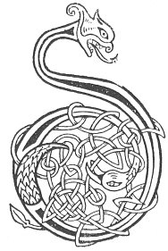

  
[Intangible Textual Heritage](../../../index.md) 
[Legends/Sagas](../../index)  [Celtic](../index.md)  [Carmina
Gadelica](../cg)  [Index](index)  [Previous](cg1023)  [Next](cg1025.md) 

------------------------------------------------------------------------

[Buy this Book at
Amazon.com](https://www.amazon.com/exec/obidos/ASIN/B0027P88YQ/internetsacredte.md)

------------------------------------------------------------------------

  
*Carmina Gadelica, Volume 1*, by Alexander Carmicheal, \[1900\], at
Intangible Textual Heritage

------------------------------------------------------------------------

 

<table data-border="0">
<colgroup>
<col style="width: 50%" />
<col style="width: 50%" />
</colgroup>
<tbody>
<tr class="odd">
<td data-valign="top" width="327">
p. 54
</td>
<td data-valign="top" width="327">
p. 55
</td>
</tr>
<tr class="even">
<td data-valign="top" width="327"><h3 id="ora-ceartais-21" data-align="center">ORA CEARTAIS [21]</h3></td>
<td data-valign="top" width="327"><h3 id="invocation-for-justice" data-align="center">INVOCATION FOR JUSTICE</h3></td>
</tr>
</tbody>
</table>

 

 

<table data-border="0">
<colgroup>
<col style="width: 25%" />
<col style="width: 25%" />
<col style="width: 25%" />
<col style="width: 25%" />
</colgroup>
<tbody>
<tr class="odd">
<td data-valign="top">
 
</td>
<td data-valign="top">
p. 54
</td>
<td data-valign="top">
 
</td>
<td data-valign="top">
p. 55
</td>
</tr>
<tr class="even">
<td data-valign="top">
 
</td>
<td data-valign="top">
DHE, tha mi liuthail m’ aodainn, 
Anns na naodh gatha greine, 
Mar a liuthail Moire a Mac, 
     Am bainne brac breine.

Meilc a bhi ’na m’ aodann, 
Maon a bhi ’na m’ ghnuis, 
Mire meala ’na mo theanga, 
     M’ anail mar an tuis.

Is dubh an taigh ud thall, 
Is duibhe daoine a th’ ann; 
Is mis an eala bhan, 
     Banruinn os an ceann.

Falbhaidh mi an ainme Dhia, 
An riochd fiadh, an riochd each, 
An riochd nathar, an riochd righ, 
     Is cathar mi na gach neach.
</td>
<td data-valign="top">
 
</td>
<td data-valign="top">
GOD, I am bathing my face 
In the nine rays of the sun, 
As Mary bathed her Son 
     In generous milk fermented.

Sweetness be in my face, 
Riches be in my countenance, 
Comb-honey be in my tongue, 
     My breath as the incense.

Black is yonder house, 
Blacker men therein; 
I am the white swan, 
     Queen over them.

I will go in the name of God, 
In likeness of deer, in likeness of horse, 
In likeness of serpent, in likeness of king, 
     More victorious am I than all persons.
</td>
</tr>
</tbody>
</table>

 

------------------------------------------------------------------------

[Next: 22. Prayer For Victory. Ora Buaidh](cg1025.md)
