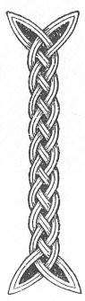

  
[Intangible Textual Heritage](../../../index) 
[Legends/Sagas](../../index)  [Celtic](../index)  [Carmina
Gadelica](../cg)  [Index](index)  [Previous](cg1024)  [Next](cg1026) 

------------------------------------------------------------------------

[Buy this Book at
Amazon.com](https://www.amazon.com/exec/obidos/ASIN/B0027P88YQ/internetsacredte)

------------------------------------------------------------------------

  
*Carmina Gadelica, Volume 1*, by Alexander Carmicheal, \[1900\], at
Intangible Textual Heritage

------------------------------------------------------------------------

 

<table data-border="0">
<colgroup>
<col style="width: 50%" />
<col style="width: 50%" />
</colgroup>
<tbody>
<tr class="odd">
<td data-valign="top" width="327">
p. 56
</td>
<td data-valign="top" width="327">
p. 57
</td>
</tr>
<tr class="even">
<td data-valign="top" width="327"><h3 id="ora-buaidh-22" data-align="center">ORA BUAIDH [22]</h3></td>
<td data-valign="top" width="327"><h3 id="prayer-for-victory" data-align="center">PRAYER FOR VICTORY</h3></td>
</tr>
</tbody>
</table>

 

<table data-border="0">
<colgroup>
<col style="width: 25%" />
<col style="width: 25%" />
<col style="width: 25%" />
<col style="width: 25%" />
</colgroup>
<tbody>
<tr class="odd">
<td data-valign="top">
 
</td>
<td data-valign="top">
p. 56
</td>
<td data-valign="top">
 
</td>
<td data-valign="top">
p. 57
</td>
</tr>
<tr class="even">
<td data-valign="top">
 
</td>
<td data-valign="top">
IONNLAIDH mi m’ aodann 
’S na naoi gatha greine, 
Mar a dh’ ionnlaid Moir a Mac, 
     Am bainne bragh na breine.

Mil a bhi ’na m’ bheul, 
Seirc a bhi ’na m’ aodann; 
An gaol thug Moire dha Mac 
     Bhi an cridhe gach cairc domhsa.

Gum bu suileach, cluasach, briathrach Dia, 
Da m’ riarachadh, is da m’ neartachadh; 
Gum bu dall, bodhar, balbh, sion sior, 
     Mo luchd tair is mo luchd taimhlis.

Teanga Chalum-chille ’na mo cheann, 
Agall Chalum-chille ’na mo chainn; 
Foisneachd Mhic bhuadhaich nan gras 
     Dhol thugam-sa an lathair sluaigh.
</td>
<td data-valign="top">
 
</td>
<td data-valign="top">
I BATHE my face 
In the nine rays of the sun, 
As Mary bathed her Son 
     In the rich fermented milk.

Honey be in my mouth, 
Affection be in my face; 
The love that Mary gave her Son 
     Be in the heart of all flesh for me.

All-seeing, all-hearing, all-inspiring may God be, 
To satisfy and to strengthen me; 
Blind, deaf, and dumb, ever, ever be 
     My contemners and my mockers,

The tongue of Columba in my head, 
The eloquence of Columba in my speech; 
The composure of the Victorious Son of grace 
     Be mine in presence of the multitude.
</td>
</tr>
</tbody>
</table>

 

 

------------------------------------------------------------------------

[Next: 23. The Lustration. An Liuthail](cg1026)
