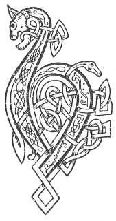

  
[Intangible Textual Heritage](../../../index.md) 
[Legends/Sagas](../../index)  [Celtic](../index.md)  [Carmina
Gadelica](../cg)  [Index](index)  [Previous](cg1026)  [Next](cg1028.md) 

------------------------------------------------------------------------

[Buy this Book at
Amazon.com](https://www.amazon.com/exec/obidos/ASIN/B0027P88YQ/internetsacredte.md)

------------------------------------------------------------------------

  
*Carmina Gadelica, Volume 1*, by Alexander Carmicheal, \[1900\], at
Intangible Textual Heritage

------------------------------------------------------------------------

 

<table data-border="0">
<colgroup>
<col style="width: 50%" />
<col style="width: 50%" />
</colgroup>
<tbody>
<tr class="odd">
<td data-valign="top" width="327">
p. 60
</td>
<td data-valign="top" width="327">
p. 61
</td>
</tr>
<tr class="even">
<td data-valign="top" width="327"><h3 id="ora-boisilidh-24" data-align="center">ORA BOISILIDH [24]</h3></td>
<td data-valign="top" width="327"><h3 id="bathing-prayer" data-align="center">BATHING PRAYER</h3></td>
</tr>
</tbody>
</table>

THIS poem was taken down at Creagorry, Benbecula, on
the 16th of December 1872, from Janet Campbell, nurse, Lochskiport,
South Uist. The reciter had many beautiful songs and lullabies of the
nursery, and many instructive sayings and fables of the animal world.
These she sang and told in the most pleasing and natural manner, to the
delight of her listeners. Birds and beasts, reptiles and insects, whales
and fishes talked and acted through her in the most amusing manner, and
in the p. 61 most idiomatic Gaelic. Her
stories had a charm for children, and it was delightful to see a small
cluster of little ones pressing round the narrator, all eyes, all ears,
all mouth, and all attention, listening to what the bear said to the
bee, the fox to the lamb, the harrier to the hen, the serpent to the
pipet, the whale to the herring, and the brown otter of the stream to
the silvery grilse of the current. Those fair young heads, now, alas!
widely apart, probably remember some of the stories heard at Janet
Campbell's knee better than those they afterwards heard in more formal
schools.

 

<table data-border="0">
<colgroup>
<col style="width: 25%" />
<col style="width: 25%" />
<col style="width: 25%" />
<col style="width: 25%" />
</colgroup>
<tbody>
<tr class="odd">
<td data-valign="top">
 
</td>
<td data-valign="top">
p. 60
</td>
<td data-valign="top">
 
</td>
<td data-valign="top">
p. 61
</td>
</tr>
<tr class="even">
<td data-valign="top">
 
</td>
<td data-valign="top">
BOISILEAG air th’ aois, 
     Boisileag air th’ fhas, 
Boisileag air th’ ugan, 
     Tuilim air a chail.

Air do chuid an chugan dhut, 
     Gruidhim agus cal; 
Air do chuid an ghabhail dhut, 
     Meal is bainne blath.

Air do chuid an chomaidh dhut, 
     Omhan agus ais; 
Air do chuid an chobhartaich 
     Le bogha agus gais.

Air do chuid an uidheam dhut, 
     Uibhean buidhe Chasg; 
Air do chuid an chuileagan, 
     M’ ulaidh agus m’ agh.

Air do chuid an chuilm dhut, 
     Uilim agus can; 
Air do chuid an chuilidh dhut 
     Cuisilin mo ghraidh.
</td>
<td data-valign="top">
 
</td>
<td data-valign="top">
A PALMFUL for thine age, 
     A palmful for thy growth, 
A palmful for thy throat, 
     A flood for thine appetite.

For thy share of the dainty, 
     Crowdie and kail; 
For thy share of the taking, 
     Honey and warm milk.

For thy share of the supping, 
     Whisked whey and milk-product; 
For thy share of the spoil, 
     With bow and with spear.

For thy share of the preparation, 
     The yellow eggs of Easter; 
For thy share of the treat, 
     My treasure and my joy,

For thy share of the feast 
     With gifts and with tribute; 
For thy share of the treasure, 
     Pulset of my love.
</td>
</tr>
<tr class="odd">
<td data-valign="top">
 
</td>
<td data-valign="top">
p. 62
</td>
<td data-valign="top">
 
</td>
<td data-valign="top">
p. 63
</td>
</tr>
<tr class="even">
<td data-valign="top">
 
</td>
<td data-valign="top">
Air do chuid an fhaghaid dhut, 
     Ri aghaidh Beinn-a-cheo; 
Air do chuid an fhiadhach dhut, 
     Is riaghladh air sloigh.

Air do chuid an luchairt, 
     An curtaibh nan righ; 
Air do chuid a fhlathas dhut, 
     Le mhathas is le shith.

A chuid nach fas ’s a chumhanaich, 
     Gum fas ’s an dubha-thrath; 
A chuid nach fas ’s an oidhche dhiot, 
     Air dhruim a mheadhon la.

       Tri baslach 
       Nan Tri run, 
       Dha do chumhn 
       Bho gach tnu, 
       Suil agus bas; 
       Baslach Ti nan dul 
       Baslach Chriosda chumh, 
       Baslach Spiorad numh, 
           Tri-un 
           Nan gras.
</td>
<td data-valign="top">
 
</td>
<td data-valign="top">
For thy share of the chase 
     Up the face of the Beinn-a-cheo; 
For thy share of the hunting 
     And the ruling over hosts.

For thy share of palaces, 
     In the courts of kings; 
For thy share of Paradise 
     With its goodness and its peace.

The part of thee that does not grow at dawn, 
     May it grow at eventide; 
The part of thee that does not grow at night, 
     May it grow at ridge of middle-day.

       The three palmfuls 
       Of the Secret Three, 
       To preserve thee 
       From every envy, 
       Evil eye and death; 
       The palmful of the God of Life, 
       The palmful of the Christ of Love, 
       The palmful of the Spirit of Peace, 
           Triune 
           Of Grace.
</td>
</tr>
</tbody>
</table>

 

------------------------------------------------------------------------

[Next: 25. God Guide Me. Dhe Stiuir Mi](cg1028.md)
