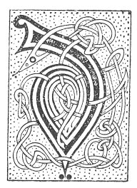

  
[Intangible Textual Heritage](../../../index.md) 
[Legends/Sagas](../../index)  [Celtic](../index.md)  [Carmina
Gadelica](../cg)  [Index](index)  [Previous](cg1027)  [Next](cg1029.md) 

------------------------------------------------------------------------

[Buy this Book at
Amazon.com](https://www.amazon.com/exec/obidos/ASIN/B0027P88YQ/internetsacredte.md)

------------------------------------------------------------------------

  
*Carmina Gadelica, Volume 1*, by Alexander Carmicheal, \[1900\], at
Intangible Textual Heritage

------------------------------------------------------------------------

 

<table data-border="0">
<colgroup>
<col style="width: 50%" />
<col style="width: 50%" />
</colgroup>
<tbody>
<tr class="odd">
<td data-valign="top" width="327">
p. 64
</td>
<td data-valign="top" width="327">
p. 65
</td>
</tr>
<tr class="even">
<td data-valign="top" width="327"><h3 id="dhe-stiuir-mi-25" data-align="center">DHE STIUIR MI [25]</h3></td>
<td data-valign="top" width="327"><h3 id="god-guide-me" data-align="center">GOD GUIDE ME</h3></td>
</tr>
</tbody>
</table>

 

<table data-border="0">
<colgroup>
<col style="width: 25%" />
<col style="width: 25%" />
<col style="width: 25%" />
<col style="width: 25%" />
</colgroup>
<tbody>
<tr class="odd">
<td data-valign="top">
 
</td>
<td data-valign="top">
p. 64
</td>
<td data-valign="top">
 
</td>
<td data-valign="top">
p. 65
</td>
</tr>
<tr class="even">
<td data-valign="top">
 
</td>
<td data-valign="top">
DHE stiuir mi le d’ ghliocas, 
Dhe smachd mi le d’ cheartas, 
Dhe foir mi le d’ throcair, 
Dhe comh’n mi le d’ chumhachd.

Dhe lion mi le d’ lanachd, 
Dhe dion mi le d’ sgaileachd, 
Dhe lion mi le d’ ghrasachd, 
Air sgath do Mhic Unga.

Iosa Criosda a shiol Dhaibhidh, 
Fear-tathaich an teampuill, 
Uan-iobairt a gharaidh, 
A bhasaich air mo shon.
</td>
<td data-valign="top">
 
</td>
<td data-valign="top">
GOD guide me with Thy wisdom, 
God chastise me with Thy justice, 
God help me with Thy mercy, 
God protect me with Thy strength.

God fill me with Thy fullness, 
God shield me with Thy shade, 
God fill me with Thy grace, 
For the sake of Thine Anointed Son.

Jesu Christ of the seed of David, 
Visiting One of the Temple, 
Sacrificial Lamb of the Garden, 
Who died for me.
</td>
</tr>
</tbody>
</table>

 

------------------------------------------------------------------------

[Next: 26. Sleep Blessing. Beannachadh Cadail](cg1029.md)
