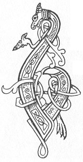

  
[Intangible Textual Heritage](../../../index.md) 
[Legends/Sagas](../../index)  [Celtic](../index.md)  [Carmina
Gadelica](../cg)  [Index](index)  [Previous](cg1028)  [Next](cg1030.md) 

------------------------------------------------------------------------

[Buy this Book at
Amazon.com](https://www.amazon.com/exec/obidos/ASIN/B0027P88YQ/internetsacredte.md)

------------------------------------------------------------------------

  
*Carmina Gadelica, Volume 1*, by Alexander Carmicheal, \[1900\], at
Intangible Textual Heritage

------------------------------------------------------------------------

 

<table data-border="0">
<colgroup>
<col style="width: 50%" />
<col style="width: 50%" />
</colgroup>
<tbody>
<tr class="odd">
<td data-valign="top" width="327">
p. 66
</td>
<td data-valign="top" width="327">
p. 67
</td>
</tr>
<tr class="even">
<td data-valign="top" width="327"><h3 id="beannachadh-cadail-26" data-align="center">BEANNACHADH CADAIL [26]</h3></td>
<td data-valign="top" width="327"><h3 id="sleep-blessing" data-align="center">SLEEP BLESSING</h3></td>
</tr>
</tbody>
</table>

 

THE night prayers of the people are numerous. They are called by various
names, as: 'Beannachadh Beinge'--Bench-Blessing, 'Beannachadh
Bobhstair'--Bolster Blessing, 'Beannachadh Cluasaig'--Pillow Blessing,
'Beannachadh Cuaiche'--Couch Blessing, 'Coich Chuaiche'--Couch Shrining,
'Altachadh Cadail'--Sleep Prayer; and other terms. Many of these prayers
are become mere fragments and phrases, supplemented by the people
according to their wants and wishes at the time. p.
67

It is touching and instructive to hear these simple old men and women in
their lowly homes addressing, as they say themselves, 'Dia mor nan dui,
Athair nan uile bheo,' the great God of life, the Father of all living.
They press upon Him their needs and their desires fully and familiarly,
but with all the awe and deference due to the Great Chief whom they wish
to approach and to attract, and whose forgiveness and aid they would
secure. And all this in language so homely yet so eloquent, so simple
yet so dignified, that the impressiveness could not be greater in
proudest fane.

 

<table data-border="0">
<colgroup>
<col style="width: 25%" />
<col style="width: 25%" />
<col style="width: 25%" />
<col style="width: 25%" />
</colgroup>
<tbody>
<tr class="odd">
<td data-valign="top">
 
</td>
<td data-valign="top">
p. 66
</td>
<td data-valign="top">
 
</td>
<td data-valign="top">
p. 67
</td>
</tr>
<tr class="even">
<td data-valign="top">
 
</td>
<td data-valign="top">
BIODH do lamb dheas, a Dhe, fo mo cheann, 
Biodh do shoills, a Spioraid, os mo chionn, 
Is biodh crois nan naodh aingeal tharam sios, 
Bho mhullach mo chinn gu iochdar mo bhonn, 
  Bho mhullach mo chinn gu iochdar mo bhonn.

O Ios gun lochd, a cheusadh gort 
Fo bhinn nan olc a sgiursadh Thu, 
A liuthad olc a rinn mo chorp! 
Nach urr’ mi nochd a chunntachadh, 
  Nach urr’ mi nochd a chunntachadh.

A Righ na fola firinnich, 
Na dibir mi a d’ mhuinntireas, 
Na tagair orm mo mhi-cheartan, 
Is na dichuimhnich a d’ chunntadh mi, 
     Na dichuimhnich a d’ chunntadh mi.

Crois Mhoir is Mhicheil, bhi tharam ann an sith, 
M’ anam a bhi am firinn, gun mhi-run am chom, 
M’ anam a bhi an sith aig Sorchair na frithe, 
Micheal crodhal an codhail m’ anama, 
     Moch agus anmoch, la agus oidhche. Amen.
</td>
<td data-valign="top">
 
</td>
<td data-valign="top">
BE Thy right hand, O God, under my head, 
Be Thy light, O Spirit, over me shining. 
And be the cross of the nine angels over me down, 
From the crown of my head to the soles of my feet, 
     From the crown of my head to the soles of my feet.

O Jesu without offence, crucified cruelly, 
Under ban of the wicked Thou wert scourged, 
The many evils done of me in the body! 
That I cannot this night enumerate, 
     That I cannot this night enumerate.

O Thou King of the blood of truth, 
Cast me not from Thy covenant, 
Exact not from me for my transgressions, 
Nor omit me in Thy numbering, 
     Nor omit me in Thy numbering.

Be the cross of Mary and of Michael over me in peace, 
Be my soul dwelling in truth, be my heart free of guile, 
Be my soul in peace with thee, Brightness of the mountains. 
Valiant Michael, meet thou my soul, 
     Morn and eve, day and night. May it be so.
</td>
</tr>
</tbody>
</table>

 

 

------------------------------------------------------------------------

[Next: 27. Come I This Day. Thigeam An Diugh](cg1030.md)
