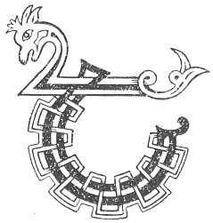

  
[Intangible Textual Heritage](../../../index.md) 
[Legends/Sagas](../../index)  [Celtic](../index.md)  [Carmina
Gadelica](../cg)  [Index](index)  [Previous](cg1029)  [Next](cg1031.md) 

------------------------------------------------------------------------

[Buy this Book at
Amazon.com](https://www.amazon.com/exec/obidos/ASIN/B0027P88YQ/internetsacredte.md)

------------------------------------------------------------------------

  
*Carmina Gadelica, Volume 1*, by Alexander Carmicheal, \[1900\], at
Intangible Textual Heritage

------------------------------------------------------------------------

 

<table data-border="0">
<colgroup>
<col style="width: 50%" />
<col style="width: 50%" />
</colgroup>
<tbody>
<tr class="odd">
<td data-valign="top" width="327">
p. 68
</td>
<td data-valign="top" width="327">
p. 69
</td>
</tr>
<tr class="even">
<td data-valign="top" width="327"><h3 id="thigeam-an-diugh-27" data-align="center">THIGEAM AN DIUGH [27]</h3></td>
<td data-valign="top" width="327"><h3 id="come-i-this-day" data-align="center">COME I THIS DAY</h3></td>
</tr>
</tbody>
</table>

 

<table data-border="0">
<colgroup>
<col style="width: 25%" />
<col style="width: 25%" />
<col style="width: 25%" />
<col style="width: 25%" />
</colgroup>
<tbody>
<tr class="odd">
<td data-valign="top">
 
</td>
<td data-valign="top">
p. 68
</td>
<td data-valign="top">
 
</td>
<td data-valign="top">
p. 69
</td>
</tr>
<tr class="even">
<td data-valign="top">
 
</td>
<td data-valign="top">
THIGEAM an diugh ’an t-Athair, 
Thigeam an diugh ’an Mhac, 
Thigeam ’an Spiorad neartor naomh; 
Thigeam an diugh le Dia, 
Thigeam an diugh le Criosd, 
Thigeam le Spiorad iocshlaint chaomh.

Dia, agus Spiorad, agus Ios, 
Bho mhullach mo chinn, 
Gu iochdar mo bhonn; 
Thigeam le mo chliu, 
Falbham le mo theasd, 
Thigeam thugad, Iosa-- 
     Iosa, dean mo leasd.
</td>
<td data-valign="top">
 
</td>
<td data-valign="top">
COME I this day to the Father, 
Come I this day to the Son, 
Come I to the Holy Spirit powerful; 
Come I this day with God, 
Come I this day with Christ, 
Come I with the Spirit of kindly balm,

God, and Spirit, and Jesus, 
From the crown of my head 
To the soles of my feet; 
Come I with my reputation, 
Come I with my testimony, 
Come I to Thee, Jesu-- 
     Jesu, shelter me.
</td>
</tr>
</tbody>
</table>

 

 

------------------------------------------------------------------------

[Next: 28. The Soul Plaint. An Achanaidh Anama](cg1031.md)
