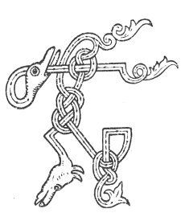

  
[Intangible Textual Heritage](../../../index) 
[Legends/Sagas](../../index)  [Celtic](../index)  [Carmina
Gadelica](../cg)  [Index](index)  [Previous](cg1031)  [Next](cg1033) 

------------------------------------------------------------------------

[Buy this Book at
Amazon.com](https://www.amazon.com/exec/obidos/ASIN/B0027P88YQ/internetsacredte)

------------------------------------------------------------------------

  
*Carmina Gadelica, Volume 1*, by Alexander Carmicheal, \[1900\], at
Intangible Textual Heritage

------------------------------------------------------------------------

 

<table data-border="0">
<colgroup>
<col style="width: 50%" />
<col style="width: 50%" />
</colgroup>
<tbody>
<tr class="odd">
<td data-valign="top" width="327">
p. 72
</td>
<td data-valign="top" width="327">
p. 73
</td>
</tr>
<tr class="even">
<td data-valign="top" width="327"><h3 id="urnuigh-chadail-29" data-align="center">URNUIGH CHADAIL [29]</h3></td>
<td data-valign="top" width="327"><h3 id="sleeping-prayer" data-align="center">SLEEPING PRAYER</h3></td>
</tr>
</tbody>
</table>

 

<table data-border="0">
<colgroup>
<col style="width: 25%" />
<col style="width: 25%" />
<col style="width: 25%" />
<col style="width: 25%" />
</colgroup>
<tbody>
<tr class="odd">
<td data-valign="top">
 
</td>
<td data-valign="top">
p. 72
</td>
<td data-valign="top">
 
</td>
<td data-valign="top">
p. 73
</td>
</tr>
<tr class="even">
<td data-valign="top">
 
</td>
<td data-valign="top">
TA mi cur m’ anama ’s mo chorp 
Air do chomaraig a nochd, a Dhe, 
Air do chomaraig, Iosa Criosda, 
Air do chomaraig, a Spioraid na firinne reidh, 
     An Triuir a sheasadh mo chuis, 
     Is nach cuireadh an cul rium fein.

Thus, Athair, tha caomh agus ceart, 
Thus, a Mhic, thug air peacadh buaidh, 
Thus, a Spioraid Naoimhe nam feart, 
Da mo ghleidheadh an nochd o thruaigh; 
     An Triuir a dheanadh mo cheart 
     Mo ghleidheadh an nochd ’s gach uair.
</td>
<td data-valign="top">
 
</td>
<td data-valign="top">
I AM placing my soul and my body 
On Thy sanctuary this night, O God, 
On Thy sanctuary, O Jesus Christ, 
On Thy sanctuary, O Spirit of perfect truth, 
     The Three who would defend my cause, 
     Nor turn Their backs upon me.

Thou, Father, who art kind and just, 
Thou, Son, who didst overcome death, 
Thou, Holy Spirit of power, 
Be keeping me this night from harm; 
     The Three who would justify me 
     Keeping me this night and always.
</td>
</tr>
</tbody>
</table>

 

------------------------------------------------------------------------

[Next: 30. The Gifts of the Three. Tiubhradh Nan Tri](cg1033)
