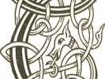

  
[Intangible Textual Heritage](../../../index) 
[Legends/Sagas](../../index)  [Celtic](../index)  [Carmina
Gadelica](../cg)  [Index](index)  [Previous](cg1032)  [Next](cg1034) 

------------------------------------------------------------------------

[Buy this Book at
Amazon.com](https://www.amazon.com/exec/obidos/ASIN/B0027P88YQ/internetsacredte)

------------------------------------------------------------------------

  
*Carmina Gadelica, Volume 1*, by Alexander Carmicheal, \[1900\], at
Intangible Textual Heritage

------------------------------------------------------------------------

<table data-border="0">
<colgroup>
<col style="width: 50%" />
<col style="width: 50%" />
</colgroup>
<tbody>
<tr class="odd">
<td data-valign="top" width="327">
p. 74
</td>
<td data-valign="top" width="327">
p. 75
</td>
</tr>
<tr class="even">
<td data-valign="top" width="327"><h3 id="tiubhradh-nan-tri-30" data-align="center">TIUBHRADH NAN TRI [30]</h3></td>
<td data-valign="top" width="327"><h3 id="the-gifts-of-the-three" data-align="center">THE GIFTS OF THE THREE</h3></td>
</tr>
</tbody>
</table>

 

<table data-border="0">
<colgroup>
<col style="width: 25%" />
<col style="width: 25%" />
<col style="width: 25%" />
<col style="width: 25%" />
</colgroup>
<tbody>
<tr class="odd">
<td data-valign="top">
 
</td>
<td data-valign="top">
p. 74
</td>
<td data-valign="top">
 
</td>
<td data-valign="top">
p. 75
</td>
</tr>
<tr class="even">
<td data-valign="top">
 
</td>
<td data-valign="top">
SPIORAID, tiubhair dhomh do phailteas, 
Athair, tiubhair dhomh do ghliocas, 
Mhic, tiubhair dhomh na m’ airceas, 
     Iosa fo fhasga do sgeith.

Laigheam sios a nochd, 
Le Trithinn mo neart, 
Le Athair, le Iosa, 
     Le Spiorad nam feart.
</td>
<td data-valign="top">
 
</td>
<td data-valign="top">
SPIRIT, give me of Thine abundance, 
Father, give me of Thy wisdom, 
Son, give me in my need, 
     Jesus beneath the shelter of Thy shield.

I lie down to-night, 
With the Triune of my strength, 
With the Father, with Jesus, 
     With the Spirit of might.
</td>
</tr>
</tbody>
</table>

 

 

------------------------------------------------------------------------

[Next: 31. Sleep Prayer. Urnuigh Chadail](cg1034)
