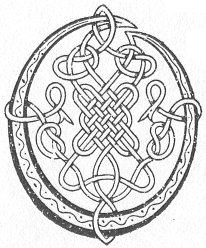

  
[Intangible Textual Heritage](../../../index.md) 
[Legends/Sagas](../../index)  [Celtic](../index.md)  [Carmina
Gadelica](../cg)  [Index](index)  [Previous](cg1033)  [Next](cg1035.md) 

------------------------------------------------------------------------

[Buy this Book at
Amazon.com](https://www.amazon.com/exec/obidos/ASIN/B0027P88YQ/internetsacredte.md)

------------------------------------------------------------------------

  
*Carmina Gadelica, Volume 1*, by Alexander Carmicheal, \[1900\], at
Intangible Textual Heritage

------------------------------------------------------------------------

 

<table data-border="0">
<colgroup>
<col style="width: 50%" />
<col style="width: 50%" />
</colgroup>
<tbody>
<tr class="odd">
<td data-valign="top" width="327">
p. 76
</td>
<td data-valign="top" width="327">
p. 77
</td>
</tr>
<tr class="even">
<td data-valign="top" width="327"><h3 id="urnuigh-chadail-31" data-align="center">URNUIGH CHADAIL [31]</h3></td>
<td data-valign="top" width="327"><h3 id="sleep-prayer" data-align="center">SLEEP PRAYER</h3></td>
</tr>
</tbody>
</table>

 

<table data-border="0">
<colgroup>
<col style="width: 25%" />
<col style="width: 25%" />
<col style="width: 25%" />
<col style="width: 25%" />
</colgroup>
<tbody>
<tr class="odd">
<td data-valign="top">
 
</td>
<td data-valign="top">
p. 76
</td>
<td data-valign="top">
 
</td>
<td data-valign="top">
p. 77
</td>
</tr>
<tr class="even">
<td data-valign="top">
 
</td>
<td data-valign="top">
O IOS gun lochd, 
A Righ nam bochd, 
A chiosadh gort 
Fo bhinn nan olc, 
Dion-s, an nochd, 
     Bho Iudas mi.

M’ anam air do laimh, a Chriosda, 
A Righ na Cathrach Neomh, 
Is tu cheannaich m’ anam, Iosa, 
     Is tu dh’ iobair beatha dhomh.

Teasruig mi air sgath mo sprochd, 
Air sgath do phais, do lot is t’ fhala fein, 
Is tabhair tearuint mi an nochd 
     Am fochar Cathair De.
</td>
<td data-valign="top">
 
</td>
<td data-valign="top">
O JESU without sin, 
King of the poor, 
Who wert sorely subdued 
Under ban of the wicked, 
Shield Thou me this night 
     From Judas.

My soul on Thine own arm, O Christ, 
Thou the King of the City of Heaven, 
Thou it was who bought’st my soul, O Jesu, 
     Thou it was who didst sacrifice Thy life for me.

Protect Thou me because of my sorrow, 
For the sake of Thy passion, Thy wounds, and Thine own blood, 
And take me in safety to-night 
     Near to the City of God.
</td>
</tr>
</tbody>
</table>

 

------------------------------------------------------------------------

[Next: 32. Resting Blessing. Beannachd Taimh](cg1035.md)
