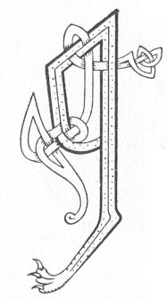

  
[Intangible Textual Heritage](../../../index.md) 
[Legends/Sagas](../../index)  [Celtic](../index.md)  [Carmina
Gadelica](../cg)  [Index](index)  [Previous](cg1034)  [Next](cg1036.md) 

------------------------------------------------------------------------

[Buy this Book at
Amazon.com](https://www.amazon.com/exec/obidos/ASIN/B0027P88YQ/internetsacredte.md)

------------------------------------------------------------------------

  
*Carmina Gadelica, Volume 1*, by Alexander Carmicheal, \[1900\], at
Intangible Textual Heritage

------------------------------------------------------------------------

<table data-border="0">
<colgroup>
<col style="width: 50%" />
<col style="width: 50%" />
</colgroup>
<tbody>
<tr class="odd">
<td data-valign="top" width="327">
p. 78
</td>
<td data-valign="top" width="327">
p. 79
</td>
</tr>
<tr class="even">
<td data-valign="top" width="327"><h3 id="beannachd-taimh-32" data-align="center">BEANNACHD TAIMH [32]</h3></td>
<td data-valign="top" width="327"><h3 id="resting-blessing" data-align="center">RESTING BLESSING</h3></td>
</tr>
</tbody>
</table>

 

<table data-border="0">
<colgroup>
<col style="width: 25%" />
<col style="width: 25%" />
<col style="width: 25%" />
<col style="width: 25%" />
</colgroup>
<tbody>
<tr class="odd">
<td data-valign="top">
 
</td>
<td data-valign="top">
p. 78
</td>
<td data-valign="top">
 
</td>
<td data-valign="top">
p. 79
</td>
</tr>
<tr class="even">
<td data-valign="top">
 
</td>
<td data-valign="top">
AN ainm an Tighearn Iosa, 
Agus Spiorad ìocshlain aigh, 
An ainm Athar Israil, 
    Sinim sios gu tamh.

Ma tha musal na dusal, 
Na run air bith dhomh ’n dan, 
Dhia fuasgail orm is cuartaich orm, 
    Is fuadaich uam mo namh.

An ainm Athar priseil, 
Is Spiorad iocshlain aigh, 
An ainm Tighearn Iosa, 
    Sinim sios gu tamh. 
*         *         *         * 
Dhia, cobhair mi is cuartaich mi, 
    O ’n uair ’s gu uair mo bhais.
</td>
<td data-valign="top">
 
</td>
<td data-valign="top">
IN name of the Lord Jesus, 
And of the Spirit of healing balm, 
In name of the Father of Israel, 
    I lay me down to rest.

If there be evil threat or quirk, 
Or covert act intent on me, 
God free me and encompass me, 
    And drive from me mine enemy.

In name of the Father precious, 
And of the Spirit of healing balm, 
In name of the Lord Jesus, 
    I lay me down to rest. 
*         *         *         * 
God, help me and encompass me, 
    From this hour till the hour of my death.
</td>
</tr>
</tbody>
</table>

 

------------------------------------------------------------------------

[Next: 33. Sleep Consecration. Coisrig Cadail](cg1036.md)
