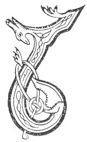

  
[Intangible Textual Heritage](../../../index.md) 
[Legends/Sagas](../../index)  [Celtic](../index.md)  [Carmina
Gadelica](../cg)  [Index](index)  [Previous](cg1035)  [Next](cg1037.md) 

------------------------------------------------------------------------

[Buy this Book at
Amazon.com](https://www.amazon.com/exec/obidos/ASIN/B0027P88YQ/internetsacredte.md)

------------------------------------------------------------------------

  
*Carmina Gadelica, Volume 1*, by Alexander Carmicheal, \[1900\], at
Intangible Textual Heritage

------------------------------------------------------------------------

 

<table data-border="0">
<colgroup>
<col style="width: 50%" />
<col style="width: 50%" />
</colgroup>
<tbody>
<tr class="odd">
<td data-valign="top" width="327">
p. 80
</td>
<td data-valign="top" width="327">
p. 81
</td>
</tr>
<tr class="even">
<td data-valign="top" width="327"><h3 id="coisrig-cadail-33" data-align="center">COISRIG CADAIL [33]</h3></td>
<td data-valign="top" width="327"><h3 id="sleep-consecration" data-align="center">SLEEP CONSECRATION</h3></td>
</tr>
</tbody>
</table>

 

<table data-border="0">
<colgroup>
<col style="width: 25%" />
<col style="width: 25%" />
<col style="width: 25%" />
<col style="width: 25%" />
</colgroup>
<tbody>
<tr class="odd">
<td data-valign="top">
 
</td>
<td data-valign="top">
p. 80
</td>
<td data-valign="top">
 
</td>
<td data-valign="top">
p. 81
</td>
</tr>
<tr class="even">
<td data-valign="top">
 
</td>
<td data-valign="top">
LUIGHIM sios an nochd 
Le Muire min ’s le Mac, 
Le Micheal finn-gheal, 
’S le Bride fo brat.

Luighim sios le Dia, 
Is luighidh Dia lium, 
Cha luigh mi sios le Briain. 
’S cha luigh Briain lium.

A Dhe nam bochd, 
Fòir orm an nochd, 
Na treig mi tort, 
A t’ ionndastaigh.

Aig meid nan lot 
A reub mi ort, 
Cha leir ’omh nochd 
An cunntachadh.

A Righ na fola firinnich, 
Na dichuimhn mi ’na d’ thuinneachadh, 
Na tagair mi ’s ’na mi cheartan, 
Na dibir mi ’na d’ chruinneachadh. 
     O ’na d’ chruinneachadh!
</td>
<td data-valign="top">
 
</td>
<td data-valign="top">
I LIE down to-night 
With fair Mary and with her Son, 
With pure-white Michael, 
And with Bride beneath her mantle.

I lie down with God, 
And God will lie down with me, 
I will not lie down with Satan, 
Nor shall Satan lie down with me.

O God of the poor, 
Help me this night, 
Omit me not entirely 
From Thy treasure-house.

For the many wounds 
That I inflicted on Thee, 
I cannot this night 
Enumerate them.

Thou King of the blood of truth, 
Do not forget me in Thy dwelling-place, 
Do not exact from me for my transgressions, 
Do not omit me in Thine ingathering. 
     In Thine ingathering.
</td>
</tr>
</tbody>
</table>

 

------------------------------------------------------------------------

[Next: 34. Bed Blessing. Beannachadh Leapa](cg1037.md)
