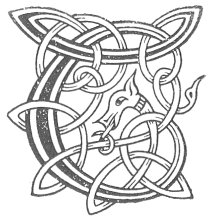

  
[Intangible Textual Heritage](../../../index) 
[Legends/Sagas](../../index)  [Celtic](../index)  [Carmina
Gadelica](../cg)  [Index](index)  [Previous](cg1038)  [Next](cg1040) 

------------------------------------------------------------------------

[Buy this Book at
Amazon.com](https://www.amazon.com/exec/obidos/ASIN/B0027P88YQ/internetsacredte)

------------------------------------------------------------------------

  
*Carmina Gadelica, Volume 1*, by Alexander Carmicheal, \[1900\], at
Intangible Textual Heritage

------------------------------------------------------------------------

<table data-border="0">
<colgroup>
<col style="width: 50%" />
<col style="width: 50%" />
</colgroup>
<tbody>
<tr class="odd">
<td data-valign="top" width="327">
p. 86
</td>
<td data-valign="top" width="327">
p. 87
</td>
</tr>
<tr class="even">
<td data-valign="top" width="327"><h3 id="coisrig-cadail-36" data-align="center">COISRIG CADAIL [36]</h3></td>
<td data-valign="top" width="327"><h3 id="sleep-consecration" data-align="center">SLEEP CONSECRATION</h3></td>
</tr>
</tbody>
</table>

 

<table data-border="0">
<colgroup>
<col style="width: 25%" />
<col style="width: 25%" />
<col style="width: 25%" />
<col style="width: 25%" />
</colgroup>
<tbody>
<tr class="odd">
<td data-valign="top">
 
</td>
<td data-valign="top">
p. 86
</td>
<td data-valign="top">
 
</td>
<td data-valign="top">
p. 87
</td>
</tr>
<tr class="even">
<td data-valign="top">
 
</td>
<td data-valign="top">
TA mise laighe nochd 
Le Athair, le Mac, 
Le Spiorad na firinn, 
Ta ’m dhion o gach lochd.

Cha laigh mi le olc, 
Cha laigh olc liom, 
Ach laighidh mi le Dia, 
Is laighidh Dia liom.

Dia agus Criosd agus Spiorad naomh, 
Is crois nan naodh aingeal fionn, 
Da m’ dhion mar Thri is mar Aon, 
Bho chlar mhullach m’aodainn gu faobhar mo bhonn.

A Righ na greine agus na gloire, 
Ios a Mhic na h-Oighe cubhra, 
Gleidh-sa sinn a glinn nan diar, 
Is a taigh nan diamha dubhra, 
     Gleidh sinn a glinn nan diar, 
     Is a taigh nan diamha dubhra.
</td>
<td data-valign="top">
 
</td>
<td data-valign="top">
I AM lying down to-night, 
With Father, with Son, 
With the Spirit of Truth, 
Who shield me from harm.

I will not lie with evil, 
Nor shall evil lie with me, 
But I will lie down with God, 
And God will lie down with me.

God and Christ and Spirit Holy, 
And the cross of the nine white angels, 
Be protecting me as Three and as One, 
From the top tablet of my face to the soles of my feet.

Thou King of the sun and of glory, 
Thou Jesu, Son of the Virgin fragrant, 
Keep Thou us from the glen of tears, 
And from the house of grief and gloom, 
     Keep us from the glen of tears, 
     From the house of grief and gloom.
</td>
</tr>
</tbody>
</table>

 

------------------------------------------------------------------------

[Next: 37. Bed Blessing. Beannachadh Leapa](cg1040)
