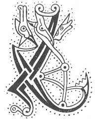

  
[Intangible Textual Heritage](../../../index.md) 
[Legends/Sagas](../../index)  [Celtic](../index.md)  [Carmina
Gadelica](../cg)  [Index](index)  [Previous](cg1039)  [Next](cg1041.md) 

------------------------------------------------------------------------

[Buy this Book at
Amazon.com](https://www.amazon.com/exec/obidos/ASIN/B0027P88YQ/internetsacredte.md)

------------------------------------------------------------------------

  
*Carmina Gadelica, Volume 1*, by Alexander Carmicheal, \[1900\], at
Intangible Textual Heritage

------------------------------------------------------------------------

<table data-border="0">
<colgroup>
<col style="width: 50%" />
<col style="width: 50%" />
</colgroup>
<tbody>
<tr class="odd">
<td data-valign="top" width="327">
p. 88
</td>
<td data-valign="top" width="327">
p. 89
</td>
</tr>
<tr class="even">
<td data-valign="top" width="327"><h3 id="beannachadh-leapa-37" data-align="center">BEANNACHADH LEAPA [37]</h3></td>
<td data-valign="top" width="327"><h3 id="bed-blessing" data-align="center">BED BLESSING</h3></td>
</tr>
</tbody>
</table>

 

<table data-border="0">
<colgroup>
<col style="width: 25%" />
<col style="width: 25%" />
<col style="width: 25%" />
<col style="width: 25%" />
</colgroup>
<tbody>
<tr class="odd">
<td data-valign="top">
 
</td>
<td data-valign="top">
p. 88
</td>
<td data-valign="top">
 
</td>
<td data-valign="top">
p. 89
</td>
</tr>
<tr class="even">
<td data-valign="top">
 
</td>
<td data-valign="top">
LAIGHIM sios an nochd, 
Le Moire mhin is le Mac, 
Le Mathair mo Righ, 
Tha da m’ dhion o gach lochd.

Cha laigh mi leis an olc, 
Cha laigh an t’ olc liom, 
Ach laighidh mi le Dia, 
Is laighidh Dia liom.

Dia agus Moire agus Micheal caon, 
Agus crois nan naodh aingeal fionn 
Da m’ dhion mar Thri is mar Aon, 
Bho chlar m’ aodainn gu faobhar mo bhuinn.

Guidheam Peadail, guidheam Pol, 
Guidheam Moir Oigh, guidheam am Mac, 
Guidheam an da Ostal dochaidh deug 
Mo ghleidheadh bho bheud ’s bho lochd; 
     O gun mi a dhol eug a nochd, 
     Gun mi a dhol eug a nochd!

A Dhia, agus a Mhoire na glorach, 
Ios, a Mhic na h-Oighe cubhraidh, 
Siantaibh sinn bho phiantaibh siorruidh, 
’S bho theine diantaidh dubhraidh, 
     Sinn bho phiantaidh siorruidh, 
     ’S bho theine diantaidh dubhraidh.
</td>
<td data-valign="top">
 
</td>
<td data-valign="top">
I AM lying down to-night, 
With Mary mild and with her Son, 
With the Mother of my King, 
Who is shielding me from harm.

I will not lie down with evil, 
Nor shall evil lie down with me, 
But I will lie down with God, 
And God will lie down with me.

God and Mary and Michael kindly 
And the cross of the nine angels fair, 
Be shielding me as Three and as One, 
From the brow of my face to the edge of my soles.

I beseech Peter, I beseech Paul, 
I beseech Mary, I beseech the Son, 
I beseech the trustful Apostles twelve 
To preserve me from hurt and harm; 
     O from dying to-night, 
     From dying to-night!

O God! O Mary of Glory! 
O Jesu! Son of the Virgin fragrant, 
Sain Ye us from the pains everlasting, 
And from the fire fierce and murky, 
     From the pains everlasting, 
     And from the fire fierce and murky!
</td>
</tr>
</tbody>
</table>

 

------------------------------------------------------------------------

[Next: 38 The Soul Shrine. A Choich Anama](cg1041.md)
