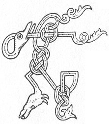

  
[Intangible Textual Heritage](../../../index.md) 
[Legends/Sagas](../../index)  [Celtic](../index.md)  [Carmina
Gadelica](../cg)  [Index](index)  [Previous](cg1043)  [Next](cg1045.md) 

------------------------------------------------------------------------

[Buy this Book at
Amazon.com](https://www.amazon.com/exec/obidos/ASIN/B0027P88YQ/internetsacredte.md)

------------------------------------------------------------------------

  
*Carmina Gadelica, Volume 1*, by Alexander Carmicheal, \[1900\], at
Intangible Textual Heritage

------------------------------------------------------------------------

<table data-border="0">
<colgroup>
<col style="width: 50%" />
<col style="width: 50%" />
</colgroup>
<tbody>
<tr class="odd">
<td data-valign="top" width="327">
p. 96
</td>
<td data-valign="top" width="327">
p. 97
</td>
</tr>
<tr class="even">
<td data-valign="top" width="327"><h3 id="urnuigh-maduinn-41" data-align="center">URNUIGH MADUINN [41]</h3></td>
<td data-valign="top" width="327"><h3 id="morning-prayer" data-align="center">MORNING PRAYER</h3></td>
</tr>
</tbody>
</table>

 

<table data-border="0">
<colgroup>
<col style="width: 25%" />
<col style="width: 25%" />
<col style="width: 25%" />
<col style="width: 25%" />
</colgroup>
<tbody>
<tr class="odd">
<td data-valign="top">
 
</td>
<td data-valign="top">
p. 96
</td>
<td data-valign="top">
 
</td>
<td data-valign="top">
p. 97
</td>
</tr>
<tr class="even">
<td data-valign="top">
 
</td>
<td data-valign="top">
TAING dhut Iosda Criosda, 
Thug mis a nios o ’n oidhche ’n raoir 
Chon solas soillse an la ’n diugh, 
Chon sonas siorruidh a chosnadh dha m’ anam, 
An cion na fal a dhoirt thu dhomh.

Cliu dhut fein a Dhe gu brath, 
An sgath gach agh a bhairig thu orm-- 
Mo bhiadh, mo bhriathar, mo ghniomh, mo chail, 
*        *        *        *        *        *

’S tha mi griosad ort 
Mo dhion bho’n olc, 
Mo dhion bho lochd, 
Mo shian an nochd 
’S mi iosal bochd, 
O Dhia nam bochd! 
O Chriosd nan lot! 
Thoir ciall dhomh ’n cois do ghrais.

Gun coraich an Ti Naomha mi, 
Gun comhnaich air muir ’s air tir mi, 
’S gun treoraich o ir gu ir mi 
Chon sith na Cathair Shiorruiche, 
       Sith na Cathair Shiorruiche.
</td>
<td data-valign="top">
 
</td>
<td data-valign="top">
THANKS be to Thee, Jesus Christ, 
Who brought’st me up from last night, 
To the gladsome light of this day, 
To win everlasting life for my soul, 
Through the blood Thou didst shed for me.

Praise be to Thee, O God, for ever, 
For the blessings Thou didst bestow on me-- 
My food, my speech, my work, my health, 
*        *        *        *        *        *

And I beseech Thee 
To shield me from sin, 
To shield me from ill, 
To sain me this night, 
And I low and poor, 
O God of the poor! 
O Christ of the wounds! 
Give me wisdom along with Thy grace.

May the Holy One claim me, 
And protect me on sea and on land, 
And lead me on from step to step, 
To the peace of the Everlasting City, 
       The peace of the Everlasting City!
</td>
</tr>
</tbody>
</table>

 

------------------------------------------------------------------------

[Next: 42 The Dedication. An Tionnsgann](cg1045.md)
