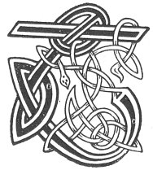

  
[Intangible Textual Heritage](../../../index.md) 
[Legends/Sagas](../../index)  [Celtic](../index.md)  [Carmina
Gadelica](../cg)  [Index](index)  [Previous](cg1044)  [Next](cg1046.md) 

------------------------------------------------------------------------

[Buy this Book at
Amazon.com](https://www.amazon.com/exec/obidos/ASIN/B0027P88YQ/internetsacredte.md)

------------------------------------------------------------------------

  
*Carmina Gadelica, Volume 1*, by Alexander Carmicheal, \[1900\], at
Intangible Textual Heritage

------------------------------------------------------------------------

 

<table data-border="0">
<colgroup>
<col style="width: 50%" />
<col style="width: 50%" />
</colgroup>
<tbody>
<tr class="odd">
<td data-valign="top" width="327">
p. 98
</td>
<td data-valign="top" width="327">
p. 99
</td>
</tr>
<tr class="even">
<td data-valign="top" width="327"><h3 id="an-tionnsgann-42" data-align="center">AN TIONNSGANN [42]</h3></td>
<td data-valign="top" width="327"><h3 id="the-dedication" data-align="center">THE DEDICATION</h3></td>
</tr>
</tbody>
</table>

 

<table data-border="0">
<colgroup>
<col style="width: 25%" />
<col style="width: 25%" />
<col style="width: 25%" />
<col style="width: 25%" />
</colgroup>
<tbody>
<tr class="odd">
<td data-valign="top">
 
</td>
<td data-valign="top">
p. 98
</td>
<td data-valign="top">
 
</td>
<td data-valign="top">
p. 99
</td>
</tr>
<tr class="even">
<td data-valign="top">
 
</td>
<td data-valign="top">
TAING dhuit, a Dhe 
Thug mise bho ’n de 
Gu tos an diugh, 
Chum solas siorruidh 
A chosnadh dha m’ chre 
Le feum maith. 
’S air son gach tiodhlac sith 
A dh’iobair thu dhomh, 
Mo smuaine, mo bhriathra, 
Mo ghniamha, mo thoil, 
Tha mi tionnsgann duit. 
Tha mi ’g urnuigh riut, 
Tha mi griasad ort, 
Mo chumail bho lochd, 
Mo chomhnadh an nochd, 
Air sgath do lot, 
Le oifreil do ghrais.
</td>
<td data-valign="top">
 
</td>
<td data-valign="top">
THANKS to Thee, God, 
Who brought'st me from yesterday 
To the beginning of to-day, 
Everlasting joy 
To earn for my soul 
With good intent. 
And for every gift of peace 
Thou bestowest on me, 
My thoughts, my words, 
My deeds, my desires 
I dedicate to Thee. 
I supplicate Thee, 
I beseech Thee, 
To keep me from offence, 
And to shield me to-night, 
For the sake of Thy wounds 
With Thine offering of grace.
</td>
</tr>
</tbody>
</table>

 

------------------------------------------------------------------------

[Next: 43. A Resting Prayer. Achanaidh Taimh](cg1046.md)
