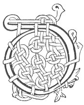

  
[Intangible Textual Heritage](../../../index) 
[Legends/Sagas](../../index)  [Celtic](../index)  [Carmina
Gadelica](../cg)  [Index](index)  [Previous](cg1045)  [Next](cg1047) 

------------------------------------------------------------------------

[Buy this Book at
Amazon.com](https://www.amazon.com/exec/obidos/ASIN/B0027P88YQ/internetsacredte)

------------------------------------------------------------------------

  
*Carmina Gadelica, Volume 1*, by Alexander Carmicheal, \[1900\], at
Intangible Textual Heritage

------------------------------------------------------------------------

 

<table data-border="0">
<colgroup>
<col style="width: 50%" />
<col style="width: 50%" />
</colgroup>
<tbody>
<tr class="odd">
<td data-valign="top" width="327">
p. 100
</td>
<td data-valign="top" width="327">
p. 101
</td>
</tr>
<tr class="even">
<td data-valign="top" width="327"><h3 id="achanaidh-taimh-43" data-align="center">ACHANAIDH TAIMH [43]</h3></td>
<td data-valign="top" width="327"><h3 id="a-resting-prayer" data-align="center">A RESTING PRAYER</h3></td>
</tr>
</tbody>
</table>

 

<table data-border="0">
<colgroup>
<col style="width: 25%" />
<col style="width: 25%" />
<col style="width: 25%" />
<col style="width: 25%" />
</colgroup>
<tbody>
<tr class="odd">
<td data-valign="top">
 
</td>
<td data-valign="top">
p. 100
</td>
<td data-valign="top">
 
</td>
<td data-valign="top">
p. 101
</td>
</tr>
<tr class="even">
<td data-valign="top">
 
</td>
<td data-valign="top">
DHE, teasruig an tigh, an teine, ’s an tan, 
Gach aon ta gabhail tamh an seo an nochd. 
Teasruig mi fein ’s mo chroilean graidh, 
Is gleidh sinn bho lamh ’s bho lochd; 
Gleidh sinn bho namh an nochd, 
Air sgath Mhic Mhuire Mhathar 
’S an ait-s ’s gach ait a bheil an tamh an nochd, 
Air an oidhche nochd ’s gach aon oidhche, 
      An oidhche nochd ’s gach aon oidhche.
</td>
<td data-valign="top">
 
</td>
<td data-valign="top">
GOD shield the house, the fire, the kine, 
Every one who dwells herein to-night. 
Shield myself and my beloved group, 
Preserve us from violence and from harm; 
Preserve us from foes this night, 
For the sake of the Son of the Mary Mother, 
In this place, and in every place wherein they dwell to-night, 
On this night and on every night, 
      This night and every night.
</td>
</tr>
</tbody>
</table>

 

------------------------------------------------------------------------

[Next: 44. House Protecting. Teisreadh Taighe](cg1047)
