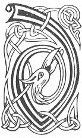

  
[Intangible Textual Heritage](../../../index.md) 
[Legends/Sagas](../../index)  [Celtic](../index.md)  [Carmina
Gadelica](../cg)  [Index](index)  [Previous](cg1046)  [Next](cg1048.md) 

------------------------------------------------------------------------

[Buy this Book at
Amazon.com](https://www.amazon.com/exec/obidos/ASIN/B0027P88YQ/internetsacredte.md)

------------------------------------------------------------------------

  
*Carmina Gadelica, Volume 1*, by Alexander Carmicheal, \[1900\], at
Intangible Textual Heritage

------------------------------------------------------------------------

 

<table data-border="0">
<colgroup>
<col style="width: 50%" />
<col style="width: 50%" />
</colgroup>
<tbody>
<tr class="odd">
<td data-valign="top" width="327">
p. 102
</td>
<td data-valign="top" width="327">
p. 103
</td>
</tr>
<tr class="even">
<td data-valign="top" width="327"><h3 id="teisreadh-taighe-44" data-align="center">TEISREADH TAIGHE [44]</h3></td>
<td data-valign="top" width="327"><h3 id="house-protecting" data-align="center">HOUSE PROTECTING</h3></td>
</tr>
</tbody>
</table>

 

<table data-border="0">
<colgroup>
<col style="width: 25%" />
<col style="width: 25%" />
<col style="width: 25%" />
<col style="width: 25%" />
</colgroup>
<tbody>
<tr class="odd">
<td data-valign="top">
 
</td>
<td data-valign="top">
p. 102
</td>
<td data-valign="top">
 
</td>
<td data-valign="top">
p. 103
</td>
</tr>
<tr class="even">
<td data-valign="top">
 
</td>
<td data-valign="top">
DHE, beannaich an ce ’s na bheil ann, 
Dhe, beannaich mo cheile is mo chlann, 
Dhe, beannaich an re a ta ’na m’ cheann, 
Is beannaich, a Dhe, laimhseachadh mo laimh; 
An am domh eirigh ’s a mhaduinn mhoich, 
Is laighe air leabaidh anamoich, 
     Beannaich m’ eirigh ’s a mhaduinn mhoich, 
     Is mo laighe air leabaidh anamoich.

Dhe, teasruig an teach ’s an t-ardrach, 
Dhe, coistrig a chlann mhathrach, 
Dhe, cuartaich an spreidh ’s an t-alach; 
Bi-sa fein na’n deigh ’s da’n taladh, 
Duair dhireas ni ri frith ’s ri fruan, 
Duair shineas mi a sios an suan, 
     Duair dhireas ni ri frith ’s ri fruan, 
     Duair shineas mi an sith gu suan.
</td>
<td data-valign="top">
 
</td>
<td data-valign="top">
GOD, bless the world and all that is therein. 
God, bless my spouse and my children, 
God, bless the eye that is in my head, 
And bless, O God, the handling of my hand; 
What time I rise in the morning early, 
What time I lie down late in bed, 
     Bless my rising in the morning early, 
     And my lying down late in bed.

God, protect the house, and the household, 
God, consecrate the children of the motherhood, 
God, encompass the flocks and the young; 
Be Thou after them and tending them, 
What time the flocks ascend hill and wold, 
What time I lie down to sleep, 
     What time the flocks ascend hill and wold, 
     What time I lie down in peace to sleep.
</td>
</tr>
</tbody>
</table>

 

------------------------------------------------------------------------

[Next: 45. Blessing of House. Beannachadh Taighe](cg1048.md)
