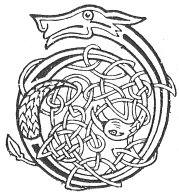

  
[Intangible Textual Heritage](../../../index) 
[Legends/Sagas](../../index)  [Celtic](../index)  [Carmina
Gadelica](../cg)  [Index](index)  [Previous](cg1047)  [Next](cg1049) 

------------------------------------------------------------------------

[Buy this Book at
Amazon.com](https://www.amazon.com/exec/obidos/ASIN/B0027P88YQ/internetsacredte)

------------------------------------------------------------------------

  
*Carmina Gadelica, Volume 1*, by Alexander Carmicheal, \[1900\], at
Intangible Textual Heritage

------------------------------------------------------------------------

 

<table data-border="0">
<colgroup>
<col style="width: 50%" />
<col style="width: 50%" />
</colgroup>
<tbody>
<tr class="odd">
<td data-valign="top" width="327">
p. 104
</td>
<td data-valign="top" width="327">
p. 105
</td>
</tr>
<tr class="even">
<td data-valign="top" width="327"><h3 id="beannachadh-taighe-45" data-align="center">BEANNACHADH TAIGHE [45]</h3></td>
<td data-valign="top" width="327"><h3 id="blessing-of-house" data-align="center">BLESSING OF HOUSE</h3></td>
</tr>
</tbody>
</table>

 

<table data-border="0">
<colgroup>
<col style="width: 25%" />
<col style="width: 25%" />
<col style="width: 25%" />
<col style="width: 25%" />
</colgroup>
<tbody>
<tr class="odd">
<td data-valign="top">
 
</td>
<td data-valign="top">
p. 104
</td>
<td data-valign="top">
 
</td>
<td data-valign="top">
p. 105
</td>
</tr>
<tr class="even">
<td data-valign="top">
 
</td>
<td data-valign="top">
DHE, beannaich an taigh, 
Bho steidh gu staidh, 
Bho chrann gu fraigh, 
Bho cheann gu saidh, 
Bho dhronn gu traigh, 
Bho sgonn gu sgaith, 
Eadar bhonn agus bhraighe, 
     Bhonn agus bhraighe.
</td>
<td data-valign="top">
 
</td>
<td data-valign="top">
GOD bless the house, 
From site to stay, 
From beam to wall, 
From end to end, 
From ridge to basement, 
From balk to roof-tree, 
From found to summit, 
     Found and summit.
</td>
</tr>
</tbody>
</table>

 

------------------------------------------------------------------------

[Next: 46. To Whom Shall I Offer Oblation. Co Dha Dhiolas Mi
Cios](cg1049)
