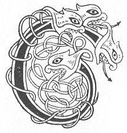

  
[Intangible Textual Heritage](../../../index) 
[Legends/Sagas](../../index)  [Celtic](../index)  [Carmina
Gadelica](../cg)  [Index](index)  [Previous](cg1048)  [Next](cg1050) 

------------------------------------------------------------------------

[Buy this Book at
Amazon.com](https://www.amazon.com/exec/obidos/ASIN/B0027P88YQ/internetsacredte)

------------------------------------------------------------------------

  
*Carmina Gadelica, Volume 1*, by Alexander Carmicheal, \[1900\], at
Intangible Textual Heritage

------------------------------------------------------------------------

 

<table data-border="0">
<colgroup>
<col style="width: 50%" />
<col style="width: 50%" />
</colgroup>
<tbody>
<tr class="odd">
<td data-valign="top" width="327">
p. 106
</td>
<td data-valign="top" width="327">
p. 107
</td>
</tr>
<tr class="even">
<td data-valign="top" width="327"><h3 id="co-dha-dhiolas-mi-cios-46" data-align="center">CO DHA DHIOLAS MI CIOS [46]</h3></td>
<td data-valign="top" width="327"><h3 id="to-whom-shall-i-offer-oblation" data-align="center">TO WHOM SHALL I OFFER OBLATION</h3></td>
</tr>
</tbody>
</table>

 

<table data-border="0">
<colgroup>
<col style="width: 25%" />
<col style="width: 25%" />
<col style="width: 25%" />
<col style="width: 25%" />
</colgroup>
<tbody>
<tr class="odd">
<td data-valign="top">
 
</td>
<td data-valign="top">
p. 106
</td>
<td data-valign="top">
 
</td>
<td data-valign="top">
p. 107
</td>
</tr>
<tr class="even">
<td data-valign="top">
 
</td>
<td data-valign="top">
CO dha dhiolas mi cios 
An ainm Mhicheil o’n aird? 
Thugam deachamh dhe m’ ni, 
Dh’ an Diobarach Aigh.

Air sgath na chunna mi, 
Do shith is d’a bhaigh, 
Tog m’ anam riut, a Mhic De, 
Na treig mi gu brath.

Cuimhnich orm anns an t-sliabh, 
Fo do sgiath dean-sa mo sgail; 
Charra na firinn na dibir mi’n cian 
B’e mo mhiann bhi gu siorruidh na d’ dhail.

Tabhair domh trusgan bainnse, 
Biodh ainghlean a cainnt rium ’s gach cas, 
Biodh ostail naomha da m’ dhion, 
Moire mhin is thus, Iosa nan gras, 
     Moire mhin is thus, Iosa nan gras.
</td>
<td data-valign="top">
 
</td>
<td data-valign="top">
To whom shall I offer oblation 
In name of Michael on high? 
I will give tithe of my means 
To the forsaken illustrious One.

Because of all that I have seen, 
Of His peace and of His mercy, 
Lift Thou my soul to Thee, O Son of God, 
Nor leave me ever.

Remember me in the mountain, 
Under Thy wing shield Thou me; 
Rock of truth, do not forsake me, 
My wish it were ever to be near Thee.

Give to me the wedding garment, 
Be angels conversing with me in every need, 
Be the holy apostles protecting me, 
The fair Mary and Thou, Jesu of grace, 
     The fair Mary and Thou, Jesu of grace.
</td>
</tr>
</tbody>
</table>

 

------------------------------------------------------------------------

[Next: 47. Hail, Mary. Earna Mhoire](cg1050)
