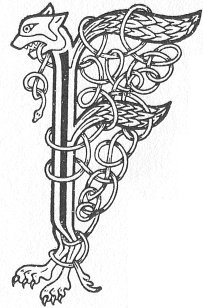

  
[Intangible Textual Heritage](../../../index) 
[Legends/Sagas](../../index)  [Celtic](../index)  [Carmina
Gadelica](../cg)  [Index](index)  [Previous](cg1049)  [Next](cg1051) 

------------------------------------------------------------------------

[Buy this Book at
Amazon.com](https://www.amazon.com/exec/obidos/ASIN/B0027P88YQ/internetsacredte)

------------------------------------------------------------------------

  
*Carmina Gadelica, Volume 1*, by Alexander Carmicheal, \[1900\], at
Intangible Textual Heritage

------------------------------------------------------------------------

 

<table data-border="0">
<colgroup>
<col style="width: 50%" />
<col style="width: 50%" />
</colgroup>
<tbody>
<tr class="odd">
<td data-valign="top" width="327">
p. 108
</td>
<td data-valign="top" width="327">
p. 109
</td>
</tr>
<tr class="even">
<td data-valign="top" width="327"><h3 id="earna-mhoire-47" data-align="center">EARNA MHOIRE [47]</h3></td>
<td data-valign="top" width="327"><h3 id="hail-mary" data-align="center">HAIL, MARY</h3></td>
</tr>
</tbody>
</table>

 

<table data-border="0">
<colgroup>
<col style="width: 25%" />
<col style="width: 25%" />
<col style="width: 25%" />
<col style="width: 25%" />
</colgroup>
<tbody>
<tr class="odd">
<td data-valign="top">
 
</td>
<td data-valign="top">
p. 108
</td>
<td data-valign="top">
 
</td>
<td data-valign="top">
p. 109
</td>
</tr>
<tr class="even">
<td data-valign="top">
 
</td>
<td data-valign="top">
FAILT, a Mhoire! failt, a Mhoire! 
      Righinn nan gras, Mathair na trocair; 
Failt, a Mhoire, air mhodh gun choimeas, 
      Geil ar slainte, fath ar solais.

Riut tha sinne, dh’ oidhch ’s a latha, 
      Sliochd seachranach Adhamh is Eubha, 
Togail ar guth ’s ag achan, 
      An gul ’s an gal ’s an deura.

Tabhair duinn, a Fhreimh an aigh, 
      O ’s tu copan nan grasa fial, 
Creid Eoin, is Pheaid, is Phail, 
      Le sgeith Airil an aird nan nial.

Deoin dhuinn, a gheug dhonn, 
      Aros ann am Fonn na sith, 
Tamh o ghabhadh ’s o anradh thonn, 
      Fo sgath toraidh do bhronn, Ios.
</td>
<td data-valign="top">
 
</td>
<td data-valign="top">
HAIL, Mary! hail, Mary! 
      Queen of grace, Mother of mercy; 
Hail, Mary, in manner surpassing, 
      Fount of our health, source of our joy.

To thee we, night and day, 
      Erring children of Adam and Eve, 
Lift our voice in supplication, 
      In groans and grief and tears.

Bestow upon us, thou Root of gladness, 
      Since thou art the cup of generous graces, 
The faith of John, and Peter, and Paul, 
      With the wings of Ariel on the heights of the clouds.

Vouchsafe to us, thou golden branch, 
      A mansion in the Realm of peace, 
Rest from the perils and stress of waves, 
      Beneath the shade of the fruit of thy womb, Jesu.
</td>
</tr>
</tbody>
</table>

 

------------------------------------------------------------------------

[Next: 48. Hail To Thee, Mary. Failte A Mhoire](cg1051)
