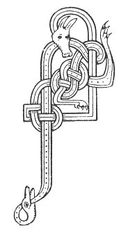

  
[Intangible Textual Heritage](../../../index.md) 
[Legends/Sagas](../../index)  [Celtic](../index.md)  [Carmina
Gadelica](../cg)  [Index](index)  [Previous](cg1056)  [Next](cg1058.md) 

------------------------------------------------------------------------

[Buy this Book at
Amazon.com](https://www.amazon.com/exec/obidos/ASIN/B0027P88YQ/internetsacredte.md)

------------------------------------------------------------------------

  
*Carmina Gadelica, Volume 1*, by Alexander Carmicheal, \[1900\], at
Intangible Textual Heritage

------------------------------------------------------------------------

<table data-border="0">
<colgroup>
<col style="width: 50%" />
<col style="width: 50%" />
</colgroup>
<tbody>
<tr class="odd">
<td data-valign="top" width="327">
p. 122
</td>
<td data-valign="top" width="327">
p. 123
</td>
</tr>
<tr class="even">
<td data-valign="top" width="327"><h3 id="a-ghealach-ur-54" data-align="center">A GHEALACH UR [54]</h3></td>
<td data-valign="top" width="327"><h3 id="the-new-moon" data-align="center">THE NEW MOON</h3></td>
</tr>
</tbody>
</table>

 

THIS little prayer is said by old men and women in the islands of Barra.
When they first see the new moon they make their obeisance to it as to a
great chief. The women curtsey gracefully and the men bow low, raising
their bonnets reverently. The bow of the men is peculiar, partaking
somewhat of the curtsey of the women, the left knee being bent and the
right drawn forward towards the middle of the left leg in a curious but
not inelegant manner.

The fragment of moon-worship is now a matter of custom rather than of
belief, although it exists over the whole British Isles. p. 123

In Cornwall the people nod to the new moon and turn silver in their
pockets. In Edinburgh cultured men and women turn the rings on their
fingers and make their wishes. A young English lady told the writer that
she had always been in the habit of bowing to the new moon, till she had
been bribed out of it by her father, a clergyman, putting money in her
pocket lest her lunar worship should compromise him with his bishop. She
naively confessed, however, that among the free mountains of Loch Etive
she reverted to the good customs of her fathers, from which she derived
great satisfaction!

 

<table data-border="0">
<colgroup>
<col style="width: 25%" />
<col style="width: 25%" />
<col style="width: 25%" />
<col style="width: 25%" />
</colgroup>
<tbody>
<tr class="odd">
<td data-valign="top">
 
</td>
<td data-valign="top">
p. 122
</td>
<td data-valign="top">
 
</td>
<td data-valign="top">
p. 123
</td>
</tr>
<tr class="even">
<td rowspan="3" data-valign="top">
 
</td>
<td data-valign="top">
AN ainm Spiorad Naomh nan gras, 
An ainm Athar na, Cathrach aigh, 
An ainm Iosa thug dhinn am bas, 
O! an ainm na Tri tha d’ ar dion ’s gach cas, 
Ma’s math a fhuair thu sinn an nochd, 
Seachd fearr gum fag thu sinn gun lochd, 
      A Ghealach gheal nan trath, 
      A Ghealach gheal nan trath.
</td>
<td data-valign="top">
 
</td>
<td data-valign="top">
IN name of the Holy Spirit of grace, 
In name of the Father of the City of peace, 
In name of Jesus who took death off us, 
Oh! in name of the Three who shield us in every need, 
If well thou hast found us to-night, 
Seven times better mayest thou leave us without harm, 
      Thou bright white Moon of the seasons, 
      Bright white Moon of the seasons. 
 

</td>
</tr>
<tr class="odd">
<td data-valign="top">
The following versification is by Mr John Henry Dixon, Inveran:--

 
</td>
<td data-valign="top">
 
</td>
<td data-valign="top">
 
</td>
</tr>
<tr class="even">
<td data-valign="top">In name of the Father Almighty, 
In name of the Glorious Son, 
In name of the Holy Spirit, 
By grace of the Three-in-One.

If to-night, O moon, thou hast found us 
      In peaceful, happy rest,
</td>
<td data-valign="top">
 
</td>
<td data-valign="top">May thy laving lustre leave us 
      Seven times still more blest.

         O moon so fair, 
         May it be so, 
         As seasons come, 
         And seasons go.
</td>
</tr>
</tbody>
</table>

 

------------------------------------------------------------------------

[Next: Header](cg1058.md)
