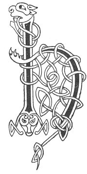

  
[Intangible Textual Heritage](../../../index) 
[Legends/Sagas](../../index)  [Celtic](../index)  [Carmina
Gadelica](../cg)  [Index](index)  [Previous](cg1058)  [Next](cg1060) 

------------------------------------------------------------------------

[Buy this Book at
Amazon.com](https://www.amazon.com/exec/obidos/ASIN/B0027P88YQ/internetsacredte)

------------------------------------------------------------------------

  
*Carmina Gadelica, Volume 1*, by Alexander Carmicheal, \[1900\], at
Intangible Textual Heritage

------------------------------------------------------------------------

 

<table data-border="0">
<colgroup>
<col style="width: 50%" />
<col style="width: 50%" />
</colgroup>
<tbody>
<tr class="odd">
<td data-valign="top" width="327">
p. 126
</td>
<td data-valign="top" width="327">
p. 127
</td>
</tr>
<tr class="even">
<td data-valign="top" width="327"><h3 id="nuall-nollaig-55" data-align="center">NUALL NOLLAIG [55]</h3></td>
<td data-valign="top" width="327"><h3 id="christmas-hail" data-align="center">CHRISTMAS HAIL</h3></td>
</tr>
</tbody>
</table>

 

CHRISTMAS chants were numerous and their recital common throughout
Scotland. They are now disappearing with the customs they accompanied.
Where they still linger their recital is relegated to boys. Formerly on
Christmas Eve bands of young men went about from house to house and from
townland to townland chanting Christmas songs. The band was called
'goisearan,' guisers, 'firduan,' song men, 'gillean Nollaig,' Christmas
lads, 'nuallairean,' rejoicers, and other names. The 'rejoicers' wore
long white shirts for surplices, and very tall white hats for mitres, in
which they made a picturesque appearance as they moved along singing
their loudest. Sometimes they went about as one band, sometimes in
sections of twos and threes. When they entered a dwelling they took
possession of a child, if there was one in the house. In the absence of
a child, a lay figure was improvised. The child was called 'Crist,
Cristean'--Christ, Little Christ. The assumed Christ was placed on a
skin, and carried three times round the fire, sunwise, by the
'ceannsnaodh'--head of the band, the song men singing the Christmas
Hail. The skin on which the symbolic Christ was carried was that of a
white male lamb without spot or blemish and consecrated to this service.
The skin was called 'uilim.' Homage and offerings and much rejoicing
were made to the symbolic Christ. The people of the house gave the
guisers bread, butter, crowdie, and other eatables, on which they
afterwards feasted.

The three poems which follow were taken down from Angus Gunn, Ness,
Lewis, then over eighty-four years of age. Angus Gunn had been a strong
man physically and was still a strong man mentally. He had lived for
many years in the island of North Roney, and gave a graphic description
of it, and of his life there. He had much oral lore which he told with
great p. 127 dramatic power. The following
tale is one of those related by him:--'Ronan came to Lewis to convert
the people to the Christian faith. He built himself a prayer-house at
Eorabay. But the people were bad and they would not give him peace. The
men quarrelled about everything, and the women quarrelled about nothing,
and Ronan was distressed and could not say his prayers for their
clamour. He prayed to be removed from the people of Eorabay, and
immediately an angel came and told him to go down to the "laimirig,"
natural landing-rock, where the "cionaran-cro," cragen was waiting him.
Ronan arose and hurried down to the sea-shore shaking the dust of
Eorabay off his feet, and taking nothing but his "pollaire," satchel,
containing the Book, on his breast. And there, stretched along the rock,
was the great "cionaran-cro," his great eyes shining like two stars of
night. Ronan sat on the back of the "cionaran-cro," and it flew with him
over the sea, usually wild as the mountains, now smooth as the plains,
and in the twinkling of two eyes reached the remote isle of the ocean.
Ronan landed on the island, and that was the land full of "nathair
bheumnaich, gribh inich, nathair nimhe, agus leomhain bheucaich"--biting
adders, taloned griffins, poisonous snakes, and roaring lions. All the
beasts of the island fled before the holy Ronan and rushed backwards
over the rocks into the sea. And that is how the rocks of the island of
Roney are grooved and scratched and lined with the claws and the nails
of the unholy creatures. The good Ronan built himself a prayer-house in
the island where he could say his prayers in peace.'

Roney is a small, precipitous island in the North Atlantic, sixty miles
from the Butt of Lewis and sixty miles from Cape Wrath, forming the apex
of a triangle between the two promontories. It is inaccessible except in
a smooth sea, which is rare there. The rocks of Roney are much striated.
The island is now uninhabited. St Ronan lived in the end of the seventh
century.

 

<table data-border="0">
<colgroup>
<col style="width: 25%" />
<col style="width: 25%" />
<col style="width: 25%" />
<col style="width: 25%" />
</colgroup>
<tbody>
<tr class="odd">
<td data-valign="top">
 
</td>
<td data-valign="top">
p. 126
</td>
<td data-valign="top">
 
</td>
<td data-valign="top">
p. 127
</td>
</tr>
<tr class="even">
<td rowspan="5" data-valign="top">
 
</td>
<td data-valign="top">
        HO Ri, ho Ri, 
Beannaicht e, beannaicht e, 
        Ho Ri, ho Ri, 
Beannaicht e, thainig ’s an am, 
        Ho Ri, ho Ri, 
Beannaicht an tigh ’s na bheil ann, 
        Ho Ri, ho Ri, 
Eadar chuall, is chlach, is chrann, 
        Ho Ri, ho Ri, 
Iomair do Dhia, eadar bhrat is aodach,
</td>
<td data-valign="top">
 
</td>
<td data-valign="top">
        HAIL to the King, hail to the King, 
Blessed is He, blessed is He, 
        Hail to the King, hail to the King, 
Blessed is He who has come betimes, 
        Hail to the King, hail to the King, 
Blessed be the house and all therein, 
        Hail to the King, hail to the King, 
'Twixt stock and stone and stave, 
        Hail to the King, hail to the King, 
Consign it to God from corslet to cover,
</td>
</tr>
<tr class="odd">
<td data-valign="top">
p. 128
</td>
<td data-valign="top">
 
</td>
<td data-valign="top">
p. 129
</td>
</tr>
<tr class="even">
<td data-valign="top">
Slainte dhaoine gun robh ann, 
        Ho Ri, ho Ri, 
Beannaicht e, beannaicht e, 
        Ho Ri, ho Hi, 
Beannaicht e, beannaicht e, 
        Ho Ri, ho Ri, 
Gum bu buan mu’n tulach sibh, 
        Ho Ri, ho Ri, 
Gum bu slan mu’n teallach sibh, 
        Ho Ri, ho Ri, 
Gum bu liuth crann ’s an tigh, 
Daoine tamh ’s a’ bhunntair, 
        Ho Ri, ho Ri, 
Beannaicht e, beannaicht e, 
        Ho Ri, ho Ri, 
Beannaicht e, beannaicht e.

        Ho Ri, ho Ri, 
Nochd oichdhe Nollaige moire, 
        Ho Ri, ho Ri, 
Beannaicht e, beannaicht e, 
        Ho Ri, ho Ri, 
Rugadh Mac na Moir Oighe, 
        Ho Ri, ho Ri, 
Beannaicht e, beannaicht e, 
        Ho Ri, ho Ri, 
Rainig a bhonnaibh an lar, 
        Ho Ri, ho Ri, 
Beannaicht e, beannaicht e, 
        Ho Ri, ho Ri, 
Shoillsich grian nam beann ard, 
        Ho Ri, ho Ri, 
Beannaicht e, beannaicht e.
</td>
<td data-valign="top">
 
</td>
<td data-valign="top">
Be the health of men therein, 
        Hail to the King, hail to the King, 
Blessed is He, blessed is He, 
        Hail to the King, hail to the King, 
Blessed is He, blessed is He, 
        Hail to the King, hail to the King, 
Lasting round the house be ye, 
        Hail to the King, hail to the King, 
Healthy round the hearth be ye, 
        Hail to the King, hail to the King, 
Many be the stakes in the house, 
And men dwelling on the foundation, 
        Hail to the King, hail to the King, 
Blessed is He, blessed is He, 
        Hail to the King, hail to the King, 
Blessed is He, blessed is He.

        Hail to the King, hail to the King, 
This night is the eve of the great Nativity, 
        Hail to the King, hail to the King, 
Blessed is He, blessed is He, 
        Hail to the King, hail to the King, 
Born is the Son of Mary the Virgin, 
        Hail to the King, hail to the King, 
Blessed is He, blessed is He, 
        Hail to the King, hail to the King, 
The soles of His feet have reached the earth, 
        Hail to the King, hail to the King, 
Blessed is He, blessed is He, 
        Hail to the King, hail to the King, 
Illumined the sun the mountains high, 
        Hail to the King, hail to the King, 
Blessed is He, blessed is He.
</td>
</tr>
<tr class="odd">
<td data-valign="top">
p. 130
</td>
<td data-valign="top">
 
</td>
<td data-valign="top">
p. 131
</td>
</tr>
<tr class="even">
<td data-valign="top">
Shoillsich fearann, shoillsich fonn, 
       Ho Ri, ho Ri, 
Beannaicht e, beannaicht e, 
       Ho Ri, ho Ri, 
Chualas an tonn air an traigh, 
       Ho Ri, ho Ri, 
Beannaicht e, beannaicht e, 
Beannaicht e, beannaicht e, 
       Ho Ri, ho Ri, 
Beannaicht an Righ, 
Gun tus, gun chrich, 
Gu suthainn, gu sior, 
Gach linn gu brath.
</td>
<td data-valign="top">
 
</td>
<td data-valign="top">
Shone the earth, shone the land, 
       Hail to the King, hail to the King, 
Blessed is He, <a href="errata.htm#1">blessed</a> is He, 
       Hail to the King, hail to the King, 
Heard was the wave upon the strand, 
       Hail to the King, hail to the King, 
Blessed is He, blessed is He, 
Blessed is He, blessed is He, 
       Hail to the King, hail to the King, 
Blessed the King, 
Without beginning, without end, 
To everlasting, to eternity, 
To all ages, to all time.
</td>
</tr>
</tbody>
</table>

 

------------------------------------------------------------------------

[Next: 56. Christmas Carol. Duan Nollaig](cg1060)
