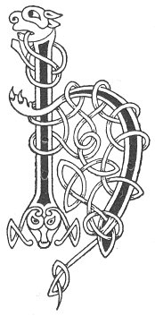

  
[Intangible Textual Heritage](../../../index) 
[Legends/Sagas](../../index)  [Celtic](../index)  [Carmina
Gadelica](../cg)  [Index](index)  [Previous](cg1060)  [Next](cg1062) 

------------------------------------------------------------------------

[Buy this Book at
Amazon.com](https://www.amazon.com/exec/obidos/ASIN/B0027P88YQ/internetsacredte)

------------------------------------------------------------------------

  
*Carmina Gadelica, Volume 1*, by Alexander Carmicheal, \[1900\], at
Intangible Textual Heritage

------------------------------------------------------------------------

 

<table data-border="0">
<colgroup>
<col style="width: 50%" />
<col style="width: 50%" />
</colgroup>
<tbody>
<tr class="odd">
<td data-valign="top" width="327">
p. 134
</td>
<td data-valign="top" width="327">
p. 135
</td>
</tr>
<tr class="even">
<td data-valign="top" width="327"><h3 id="duan-nollaig-57" data-align="center">DUAN NOLLAIG [57]</h3></td>
<td data-valign="top" width="327"><h3 id="christmas-chant" data-align="center">CHRISTMAS CHANT</h3></td>
</tr>
</tbody>
</table>

 

<table data-border="0">
<colgroup>
<col style="width: 25%" />
<col style="width: 25%" />
<col style="width: 25%" />
<col style="width: 25%" />
</colgroup>
<tbody>
<tr class="odd">
<td data-valign="top">
 
</td>
<td data-valign="top">
p. 134
</td>
<td data-valign="top">
 
</td>
<td data-valign="top">
p. 135
</td>
</tr>
<tr class="even">
<td data-valign="top">
 
</td>
<td data-valign="top">
HOIRE! hoire! beannaicht e! beannaicht e! 
Hoire! hoire! beannaicht e! beannaicht e! 
      Ho! hi! beannaicht an Righ! 
      Ho! hi! biodh aoibh.

Buaidh biodh air an tulaich seo, 
Na chualas leibh ’s na chunnas leibh, 
Air na leaca loma loinnear lair, 
      ’S air na clacha corrach cuimir clair, 
      Hoire! hoire! beannaicht e! beannaicht e!

Beannaich an taigh ’s na bheil ann, 
Eadar chuaill is chlach is chrann 
Imir do Dhia eadar bhrat is aodach, 
      Slainte dhaoine gun robh ann, 
      Hoire! hoire! beannaicht e! beannaicht e!

Gu mu buan mu’n tulach sibh, 
Gu mu slan mu’n teallach sibh, 
Gu mu liuth dul ’s ceann sguilb ’s an aros, 
      Daoine tamh ’s a bhunntair, 
      Hoire! hoire! beannaicht e! beannaicht e!
</td>
<td data-valign="top">
 
</td>
<td data-valign="top">
HAIL King! hail King! blessed is He! blessed is He! 
Hail King! hail King! blessed is He! blessed is He! 
      Ho, hail! blessed the King! 
      Ho, hi! let there be joy!

Prosperity be upon this dwelling, 
On all that ye have heard and seen, 
On the bare bright floor flags, 
      On the shapely standing stone staves, 
      Hail King! hail King! blessed is He! blessed is He!

Bless this house and all that it contains, 
From rafter and stone and beam; 
Deliver it to God from pall to cover, 
      Be the healing of men therein, 
      Hail King! hail King! blessed is He! blessed is He!

Be ye in lasting possession of the house, 
Be ye healthy about the hearth, 
Many be the ties and stakes in the homestead, 
      People dwelling on this foundation, 
      Hail King! hail King! blessed is He! blessed is He!
</td>
</tr>
<tr class="odd">
<td data-valign="top">
 
</td>
<td data-valign="top">
p. 136
</td>
<td data-valign="top">
 
</td>
<td data-valign="top">
p. 137
</td>
</tr>
<tr class="even">
<td data-valign="top">
 
</td>
<td data-valign="top">
Iobair dh ’an Ti eadar bhonn agus bhrat, 
Eadar chuaill agus chlach agus chrann; 
Iobair a ris eadar shlat agus aodach, 
Slanadh shaoghal a dhaoine th’ ann, 
      Hoire! hoire! beannaicht e! beannaicht e! 
      Hoire! hoire! beannaicht e! beannaicht e! 
           Ho, hi, beannaicht an Righ, 
               Ho, hi, biodh aoibh!

         Beannaicht an Righ, 
         Gun tus gun chrich, 
         Gu suth, gu sior, 
         Gach linn gu brath, 
               Ho! hi! biodh aoibh!
</td>
<td data-valign="top">
 
</td>
<td data-valign="top">
Offer to the Being from found to cover, 
Include stave and stone and beam; 
Offer again both rods and cloth, 
Be health to the people therein, 
      Hail King! hail King! blessed is He! blessed is He! 
      Hail King! hail King! blessed is He! blessed is He! 
           Ho, hail! blessed the King! 
               Let there be joy!

         Blessed the King, 
         Without beginning, without ending, 
         To everlasting, to eternity, 
               Every generation for aye, 
               Ho! hi! let there be joy!
</td>
</tr>
</tbody>
</table>

 

------------------------------------------------------------------------

[Next: 58. Hey The Gift. Heire Bannag](cg1062)
