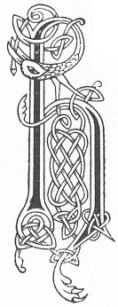

  
[Intangible Textual Heritage](../../../index) 
[Legends/Sagas](../../index)  [Celtic](../index)  [Carmina
Gadelica](../cg)  [Index](index)  [Previous](cg1061)  [Next](cg1063) 

------------------------------------------------------------------------

[Buy this Book at
Amazon.com](https://www.amazon.com/exec/obidos/ASIN/B0027P88YQ/internetsacredte)

------------------------------------------------------------------------

  
*Carmina Gadelica, Volume 1*, by Alexander Carmicheal, \[1900\], at
Intangible Textual Heritage

------------------------------------------------------------------------

<table data-border="0">
<colgroup>
<col style="width: 50%" />
<col style="width: 50%" />
</colgroup>
<tbody>
<tr class="odd">
<td data-valign="top" width="327">
p. 138
</td>
<td data-valign="top" width="327">
p. 139
</td>
</tr>
<tr class="even">
<td data-valign="top" width="327"><h3 id="heire-bannag-58" data-align="center">HEIRE BANNAG [58]</h3></td>
<td data-valign="top" width="327"><h3 id="hey-the-gift" data-align="center">HEY THE GIFT</h3></td>
</tr>
</tbody>
</table>

 

THESE carols were sung by a band of men who went about from house to
house in the townland. The band selected a leader for their singing and
for their actions throughout the night. This leader was called
'fear-duan,' song-man, and the others were p.
139 called 'fir-fuinn,' chorus-men. When they had sung their
carols at a house, two or three bannocks were handed out to them through
a window.

The song-man got half of every bannock so received, and the other half
went to the chorus-men.

 

<table data-border="0">
<colgroup>
<col style="width: 25%" />
<col style="width: 25%" />
<col style="width: 25%" />
<col style="width: 25%" />
</colgroup>
<tbody>
<tr class="odd">
<td data-valign="top">
 
</td>
<td data-valign="top">
p. 138
</td>
<td data-valign="top">
 
</td>
<td data-valign="top">
p. 139
</td>
</tr>
<tr class="even">
<td data-valign="top">
 
</td>
<td data-valign="top">
HEIRE Bannag, hoire Bannag, 
Heire Bannag, air a bheo.

Chaidh Muire mhin gheal air a glun, 
Is e Righ nan dul a bha ’na h-uchd.

Taobh an t-sorcain, taobh an t-searcain, 
Buailtear boicionn air an spar.

’G innse duinn gun do rugadh Criosd, 
Righ nan righ, a tir na slaint.

Chi mi tulach, chi mi traigh, 
Chi mi ullaim air an t-snamh.

Chi mi ainghlean air an luinn, 
Tighinn le cimh is cairdeas duinn.
</td>
<td data-valign="top">
 
</td>
<td data-valign="top">
HEY the Gift, ho the Gift, 
Hey the Gift on the living.

The fair Mary went upon her knee, 
It was the King of glory who was on her breast.

The side of the sack (?) the side of the sark (?) 
The hide is struck upon the spar.

To tell to us that Christ is born, 
The King of kings of the land of salvation.

I see the hills, I see the strand, 
I see the host upon the wing.

I see angels on clouds, [waves 
Coming with speech and friendship to us.
</td>
</tr>
</tbody>
</table>

 

------------------------------------------------------------------------

[Next: 59. Hey The Gift, Ho The Gift. Eire Bannag, Hoire Bannag](cg1063)
