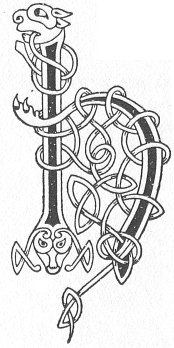

  
[Intangible Textual Heritage](../../../index.md) 
[Legends/Sagas](../../index)  [Celtic](../index.md)  [Carmina
Gadelica](../cg)  [Index](index)  [Previous](cg1062)  [Next](cg1064.md) 

------------------------------------------------------------------------

[Buy this Book at
Amazon.com](https://www.amazon.com/exec/obidos/ASIN/B0027P88YQ/internetsacredte.md)

------------------------------------------------------------------------

  
*Carmina Gadelica, Volume 1*, by Alexander Carmicheal, \[1900\], at
Intangible Textual Heritage

------------------------------------------------------------------------

<table data-border="0">
<colgroup>
<col style="width: 50%" />
<col style="width: 50%" />
</colgroup>
<tbody>
<tr class="odd">
<td data-valign="top" width="327">
p. 140
</td>
<td data-valign="top" width="327">
p. 141
</td>
</tr>
<tr class="even">
<td data-valign="top" width="327"><h3 id="heire-bannag-hoire-bannag-59" data-align="center">HEIRE BANNAG, HOIRE BANNAG [59]</h3></td>
<td data-valign="top" width="327"><h3 id="hey-the-gift-ho-the-gift" data-align="center">HEY THE GIFT, HO THE GIFT</h3></td>
</tr>
</tbody>
</table>

 

<table data-border="0">
<colgroup>
<col style="width: 25%" />
<col style="width: 25%" />
<col style="width: 25%" />
<col style="width: 25%" />
</colgroup>
<tbody>
<tr class="odd">
<td data-valign="top">
 
</td>
<td data-valign="top">
p. 140
</td>
<td data-valign="top">
 
</td>
<td data-valign="top">
p. `4`
</td>
</tr>
<tr class="even">
<td data-valign="top">
 
</td>
<td data-valign="top">
HEIRE Bannag, hoire Bannag, 
        Heire Bannag, air a bheo.

Mac na niula, Mac na neula, 
Mac na runna, Mac na reula, 
        Heire Bannag, etc.

Mac na dile, Mac na deire, 
Mac na spire, Mac na speura, 
        Heire Bannag, etc.

Mac na lasa, Mac na leusa, 
Mac na cruinne, Mac na ce, 
        Heire Bannag, etc.

Mac nan dula, Mac nan neamha, 
Mac na gile, Mac na greine, 
        Heire Bannag, etc.

Mac Moire na De-meine, 
Is Mac De tus gach sgeula, 
        Heire Bannag, etc.
</td>
<td data-valign="top">
 
</td>
<td data-valign="top">
HEY the Gift, ho the Gift, 
        Hey the Gift, on the living.

Son of the dawn, Son of the clouds, 
Son of the planet, Son of the star, 
        Hey the Gift, etc.

Son of the rain, Son of the dew, 
Son of the welkin, Son of the sky, 
        Hey the Gift, etc.

Son of the flame, Son of the light, 
Son of the sphere, Son of the globe, 
        Hey the Gift, etc.

Son of the elements, Son of the heavens, 
Son of the moon, Son of the sun, 
        Hey the Gift, etc.

Son of Mary of the God-mind, 
And the Son of God first of all news, 
        Hey the Gift, etc.
</td>
</tr>
</tbody>
</table>

 

------------------------------------------------------------------------

[Next: 60. The Gift of Power. Bannag Nam Buadh](cg1064.md)
