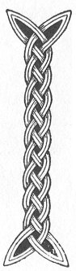

  
[Intangible Textual Heritage](../../../index) 
[Legends/Sagas](../../index)  [Celtic](../index)  [Carmina
Gadelica](../cg)  [Index](index)  [Previous](cg1063)  [Next](cg1065) 

------------------------------------------------------------------------

[Buy this Book at
Amazon.com](https://www.amazon.com/exec/obidos/ASIN/B0027P88YQ/internetsacredte)

------------------------------------------------------------------------

  
*Carmina Gadelica, Volume 1*, by Alexander Carmicheal, \[1900\], at
Intangible Textual Heritage

------------------------------------------------------------------------

 

<table data-border="0">
<colgroup>
<col style="width: 50%" />
<col style="width: 50%" />
</colgroup>
<tbody>
<tr class="odd">
<td data-valign="top" width="327">
p. 142
</td>
<td data-valign="top" width="327">
p. 143
</td>
</tr>
<tr class="even">
<td data-valign="top" width="327"><h3 id="bannag-nam-buadh-60" data-align="center">BANNAG NAM BUADH [60]</h3></td>
<td data-valign="top" width="327"><h3 id="the-gift-of-power" data-align="center">THE GIFT OF POWER</h3></td>
</tr>
</tbody>
</table>

 

<table data-border="0">
<colgroup>
<col style="width: 25%" />
<col style="width: 25%" />
<col style="width: 25%" />
<col style="width: 25%" />
</colgroup>
<tbody>
<tr class="odd">
<td data-valign="top">
 
</td>
<td data-valign="top">
p. 142
</td>
<td data-valign="top">
 
</td>
<td data-valign="top">
p. 143
</td>
</tr>
<tr class="even">
<td data-valign="top">
 
</td>
<td data-valign="top">
IS mise Bannag, is mise Bochd, 
Is mise Fear na h-oidhche nochd.

Is mise Mac De anns an dorus, 
Di-luain air thuaradh nam bannag.

Is uasal Bride mhin-gheal air a glun, 
Is uasal High nan dul ’na h-uchd.

Mac na gile, Mac na greine, 
Mac Moire mor na De-meine,

Crois air gach guala dheis, 
Mis is dorus, fosgail thusa.

Is leir ’omh tulach, is leir ’omh traigh, 
Is leir ’omh ainghlean tighinn air snamh.

Is leir ’omh calaman, cuimir, caon, 
Tighinn le caomh is cairdeas duinn.
</td>
<td data-valign="top">
 
</td>
<td data-valign="top">
I AM the Gift, I am the Poor, 
I am the Man of this night.

I am the Son of God in the door, 
On Monday seeking the gifts.

Noble is Bride the gentle fair on her knee, 
Noble the King of glory on her breast.

Son of the moon, Son of the sung 
Great Son of Mary of God-like mind.

A cross on each right shoulder, 
I am in the door, open thou.

I see the hills, I see the strand, 
I see angels heralding on high.

I see the dove shapely, benign, 
Coming with kindness and friendship to us.
</td>
</tr>
</tbody>
</table>

 

------------------------------------------------------------------------

[Next: 61. The Virgin and Child. An Oigh Agus An Leanabh](cg1065)
