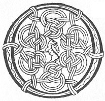

  
[Intangible Textual Heritage](../../../index.md) 
[Legends/Sagas](../../index)  [Celtic](../index.md)  [Carmina
Gadelica](../cg)  [Index](index)  [Previous](cg1065)  [Next](cg1067.md) 

------------------------------------------------------------------------

[Buy this Book at
Amazon.com](https://www.amazon.com/exec/obidos/ASIN/B0027P88YQ/internetsacredte.md)

------------------------------------------------------------------------

  
*Carmina Gadelica, Volume 1*, by Alexander Carmicheal, \[1900\], at
Intangible Textual Heritage

------------------------------------------------------------------------

 

<table data-border="0">
<colgroup>
<col style="width: 50%" />
<col style="width: 50%" />
</colgroup>
<tbody>
<tr class="odd">
<td data-valign="top" width="327">
p. 146
</td>
<td data-valign="top" width="327">
p. 147
</td>
</tr>
<tr class="even">
<td data-valign="top" width="327"><h3 id="rugadh-buachaille-nan-treud-62" data-align="center">RUGADH BUACHAILLE NAN TREUD [62]</h3></td>
<td data-valign="top" width="327"><h3 id="the-shepherd-of-the-flock-was-born" data-align="center">THE SHEPHERD OF THE FLOCK WAS BORN</h3></td>
</tr>
</tbody>
</table>

 

<table data-border="0">
<colgroup>
<col style="width: 25%" />
<col style="width: 25%" />
<col style="width: 25%" />
<col style="width: 25%" />
</colgroup>
<tbody>
<tr class="odd">
<td data-valign="top">
 
</td>
<td data-valign="top">
p. 146
</td>
<td data-valign="top">
 
</td>
<td data-valign="top">
p. 147
</td>
</tr>
<tr class="even">
<td data-valign="top">
 
</td>
<td data-valign="top">
OIDHCHE sin a dhealraich an reult, 
Rugadh Buachaille nan treud, 
Le Oigh nan ceudaibh beus, 
     Moire Mhathar.

An Trianaid shiorruidh r’a taobh, 
Ann am frasach fuar, faoin. 
Thig ’s thoir deachamh de d’ mhaoin, 
     Dh’ an t-Slan-Fhear.

An cobhrach, ciochrach, caomh, 
Gun aon dachaidh fo ’n t-saoghal, 
Am Fogaran naomha, maoth, 
     ’Manul!

A thri ainglibh nam buadh, 
Thigibh, thigibh a nuas; 
Do Chriosd an t-sluaigh 
     Thugaibh failte.

Pogaibh a bhasa, 
Tioramaichibh a chasa 
Le falt bhur cinn; 
’S O! Thi na cruinne, 
’S Iosa, Mhicheil, Mhuire, 
     Na fagaibh sinn.
</td>
<td data-valign="top">
 
</td>
<td data-valign="top">
THAT night the star shone 
Was born the Shepherd of the Flock, 
Of the Virgin of the hundred charms; 
     The Mary Mother.

The Trinity eternal by her side, 
In the manger cold and lowly. 
Come and give tithes of thy means 
     To the Healing Man.

The foam-white breastling beloved, 
Without one home in the world, 
The tender holy Babe forth driven, 
     Immanuel!

Ye three angels of power, 
Come ye, come ye down; 
To the Christ of the people 
     Give ye salutation.

Kiss ye His hands, 
Dry ye His feet 
With the hair of your heads; 
And O! Thou world-pervading God, 
And Ye, Jesu, Michael, Mary, 
     Do not Ye forsake us.
</td>
</tr>
</tbody>
</table>

 

------------------------------------------------------------------------

[Next: 63. Hogmanay of the Sack. Calluinn A Bhuilg](cg1067.md)
