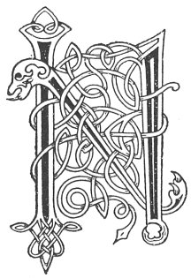

  
[Intangible Textual Heritage](../../../index) 
[Legends/Sagas](../../index)  [Celtic](../index)  [Carmina
Gadelica](../cg)  [Index](index)  [Previous](cg1068)  [Next](cg1070) 

------------------------------------------------------------------------

[Buy this Book at
Amazon.com](https://www.amazon.com/exec/obidos/ASIN/B0027P88YQ/internetsacredte)

------------------------------------------------------------------------

  
*Carmina Gadelica, Volume 1*, by Alexander Carmicheal, \[1900\], at
Intangible Textual Heritage

------------------------------------------------------------------------

 

<table data-border="0">
<colgroup>
<col style="width: 50%" />
<col style="width: 50%" />
</colgroup>
<tbody>
<tr class="odd">
<td data-valign="top" width="327">
p. 152
</td>
<td data-valign="top" width="327">
p. 153
</td>
</tr>
<tr class="even">
<td data-valign="top" width="327"><h3 id="duan-callaig-65" data-align="center">DUAN CALLAIG [65]</h3></td>
<td data-valign="top" width="327"><h3 id="the-song-of-hogmanay" data-align="center">THE SONG OF HOGMANAY</h3></td>
</tr>
</tbody>
</table>

 

<table data-border="0">
<colgroup>
<col style="width: 25%" />
<col style="width: 25%" />
<col style="width: 25%" />
<col style="width: 25%" />
</colgroup>
<tbody>
<tr class="odd">
<td data-valign="top">
 
</td>
<td data-valign="top">
p. 152
</td>
<td data-valign="top">
 
</td>
<td data-valign="top">
p. 153
</td>
</tr>
<tr class="even">
<td data-valign="top">
 
</td>
<td data-valign="top">
NIST o thaine sinn dh’ an duthaich, 
Dh’ urachadh dhuibh na Callaig, 
Cha ruig uine dhuinn bhi ’g innse, 
        Bha i ann ri linn ar seanar.

A direadh ri tobht an taighe, 
A teurnadh aig an dorus, 
Mo dhuan a ghabhail modhail, 
        Mar b’ eol domh aig a Challaig.

Caisein Callaig ’na mo phocaid, 
Is mor an ceo thig as an fhear ud, 
Chan ’eil aon a gheobh de aile, 
        Nach bi gu brath de fallain.

Gheobh fear an taighe ’na dhorn e, 
Cuiridh e shron anns an teallach; 
Theid e deiseil air na paisdean, 
        Is seachd araid bean an taighe.

Gheobh a bhean e, is i ’s t-fhiach e, 
Lamh a riarachadh na Callaig, 
Lamh a bhairig cais is im duinn, 
        Lamh gun spiocaireachd, gun ghainne.
</td>
<td data-valign="top">
 
</td>
<td data-valign="top">
Now since we came to the country 
To renew to you the Hogmanay, 
Time will not allow us to explain, 
        It has been since the age of our fathers.

Ascending the wall of the house, 
Descending at the door, 
My carol to say modestly, 
        As becomes me at the Hogmanay.

The Hogmanay skin is in my pocket, 
Great the fume that will come from that; 
No one who shall inhale its odour, 
        But shall be for ever from it healthy.

The house-man will get it in his grasp, 
He will put its point in the fire; 
He will go sunwise round the children, 
        And very specially round the goodwife.

The wife will get it, she it is who deserves it, 
The hand to distribute the Hogmanay, 
The hand to bestow upon us cheese and butter, 
        The hand without niggardliness, without meanness.
</td>
</tr>
<tr class="odd">
<td data-valign="top">
 
</td>
<td data-valign="top">
p. 154
</td>
<td data-valign="top">
 
</td>
<td data-valign="top">
p. 155
</td>
</tr>
<tr class="even">
<td data-valign="top">
 
</td>
<td data-valign="top">
Bho ’n ta tart air tighinn an duthaich, 
Is nach bi duil againn ri annas, 
Rud beag a shugh an t-samhraidh, 
        B’ annsa leinn e leis an aran.

Mur bheil sin againn ri fhaotainn, 
Ma dh’ fhaodas tu, na cum maill oirnn; 
Mise gille Mhic De air Chollaig, 
        Eirich fein is fosgail dorus, 
             Callain seo! Callain seo!
</td>
<td data-valign="top">
 
</td>
<td data-valign="top">
Since drought has come upon the land, 
And that we do not expect rarity, 
A little of the substance of the summer, 
        Would we desire with the bread.

If that we are not to have it, 
If thou mayest, do not detain us; 
I am the servant of God's Son on Hogmanay, 
        Arise thyself and open the door. 
             Hogmanay here! Hogmanay here!
</td>
</tr>
</tbody>
</table>

 

------------------------------------------------------------------------

[Next: 66. Hogmanay. Oidhche Challaig](cg1070)
