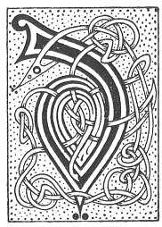

  
[Intangible Textual Heritage](../../../index) 
[Legends/Sagas](../../index)  [Celtic](../index)  [Carmina
Gadelica](../cg)  [Index](index)  [Previous](cg1070)  [Next](cg1072) 

------------------------------------------------------------------------

[Buy this Book at
Amazon.com](https://www.amazon.com/exec/obidos/ASIN/B0027P88YQ/internetsacredte)

------------------------------------------------------------------------

  
*Carmina Gadelica, Volume 1*, by Alexander Carmicheal, \[1900\], at
Intangible Textual Heritage

------------------------------------------------------------------------

<table data-border="0">
<colgroup>
<col style="width: 50%" />
<col style="width: 50%" />
</colgroup>
<tbody>
<tr class="odd">
<td data-valign="top" width="327">
p. 158
</td>
<td data-valign="top" width="327">
p. 159
</td>
</tr>
<tr class="even">
<td data-valign="top" width="327"><h3 id="beannachadh-bliadhna-uir-67" data-align="center">BEANNACHADH BLIADHNA UIR [67]</h3></td>
<td data-valign="top" width="327"><h3 id="the-blessing-of-the-new-year" data-align="center">THE BLESSING OF THE NEW YEAR</h3></td>
</tr>
</tbody>
</table>

 

THIS poem was repeated the first thing on the first
day of the year. It was p. 159 common
throughout the Highlands and Islands. The writer has heard versions of
it in many places.

 

<table data-border="0">
<colgroup>
<col style="width: 25%" />
<col style="width: 25%" />
<col style="width: 25%" />
<col style="width: 25%" />
</colgroup>
<tbody>
<tr class="odd">
<td data-valign="top">
 
</td>
<td data-valign="top">
p. 158
</td>
<td data-valign="top">
 
</td>
<td data-valign="top">
p. 159
</td>
</tr>
<tr class="even">
<td data-valign="top">
 
</td>
<td data-valign="top">
DHE, beannaich dhomh an la ur, 
Nach do thuradh dhomh roimhe riamh; 
Is ann gu beannachadh do ghnuis, 
Thug thu ’n uine seo dhomh, a Dhia.

Beannaich thusa dhomh mo shuil, 
Beannaicheadh mo shuil na chi; 
Beannaichidh mise mo nabaidh, 
Beannaicheadh mo nabaidh mi.

Dhe tabhair dhomh-sa cridhe glan, 
Na leig a seall do shula mi; 
Beannaich dhomh mo ghin ’s mo bhean, 
’S beannaich domh mo nearc ’s mo ni.
</td>
<td data-valign="top">
 
</td>
<td data-valign="top">
GOD, bless to me the new day, 
Never vouchsafed to me before; 
It is to bless Thine own presence 
Thou hast given me this time, O God.

Bless Thou to me mine eye, 
May mine eye bless all it sees; 
I will bless my neighbour, 
May my neighbour bless me.

God, give me a clean heart, 
Let me not from sight of Thine eye; 
Bless to me my children and my wife, 
And bless to me my means and my cattle.
</td>
</tr>
</tbody>
</table>

 

------------------------------------------------------------------------

[Next: 68. Christ the Priest Above Us. Criosda Cleireach Os Ar
Cionn](cg1072)
