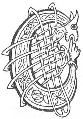

  
[Intangible Textual Heritage](../../../index) 
[Legends/Sagas](../../index)  [Celtic](../index)  [Carmina
Gadelica](../cg)  [Index](index)  [Previous](cg1071)  [Next](cg1073) 

------------------------------------------------------------------------

[Buy this Book at
Amazon.com](https://www.amazon.com/exec/obidos/ASIN/B0027P88YQ/internetsacredte)

------------------------------------------------------------------------

  
*Carmina Gadelica, Volume 1*, by Alexander Carmicheal, \[1900\], at
Intangible Textual Heritage

------------------------------------------------------------------------

<table data-border="0">
<colgroup>
<col style="width: 50%" />
<col style="width: 50%" />
</colgroup>
<tbody>
<tr class="odd">
<td data-valign="top" width="327">
p. 160
</td>
<td data-valign="top" width="327">
p. 161
</td>
</tr>
<tr class="even">
<td data-valign="top" width="327"><h3 id="criosda-cleireach-os-ar-cionn-68" data-align="center">CRIOSDA CLEIREACH OS AR CIONN [68]</h3></td>
<td data-valign="top" width="327"><h3 id="christ-the-priest-above-us" data-align="center">CHRIST THE PRIEST ABOVE US</h3></td>
</tr>
</tbody>
</table>

 

<table data-border="0">
<colgroup>
<col style="width: 25%" />
<col style="width: 25%" />
<col style="width: 25%" />
<col style="width: 25%" />
</colgroup>
<tbody>
<tr class="odd">
<td data-valign="top">
 
</td>
<td data-valign="top">
p. 160
</td>
<td data-valign="top">
 
</td>
<td data-valign="top">
p. 161
</td>
</tr>
<tr class="even">
<td data-valign="top">
 
</td>
<td data-valign="top">
CRIOSDA Cleireach os ar cionn, 
Dh’ orduich Ti nan dul do gach dull a t’ann. 
        Criosda Cleireach os ar cionn.

Nochd oidhch a chrochaidh chruaidh, 
Crann cruaidh ris na chrochadh Criosd. 
        Criosda Cleireach os ar cionn.

Is uasal Bannag, is uasal Bochd, 
Is uasal Fear na h-oidhche nochd. 
        Criosda Cleireach os ar cionn.

Is i Bride mhin chaidh air a glun, 
Is e Righ nan dul a ta ’na h-uchd, 
        Criosda Cleireach os ar cionn.

Chluinn mi tulach, chluinn mi traigh, 
Chluinn mi ainghlean air an t-snamh, 
        Criosda Cleireach os ar cionn.

Chluinn mi Cairbre cuimir, cruinn, 
Tighinn cluimh le cairdeas duinn. 
        Criosda Cleireach os ar cionn.

Is ioma tionailt air an tulaich, 
Gun farmad duine ri cheile. 
        Criosda Cleireach os ar cionn.

Is mise gille Mic De is an dorus, 
Eirich fein is fosgail domh e. 
        Criosda Cleireach os ar cionn.
</td>
<td data-valign="top">
 
</td>
<td data-valign="top">
CHRIST the Priest above us, 
Ordained of God for all living. 
        Christ the Priest above us.

To-night, the night of the cross of agony, 
The cross of anguish to which Christ was crucified. 
        Christ the Priest above us.

Noble the Gift! noble the Poor! 
Noble the Man of this night. 
        Christ the Priest above us.

It was Bride the fair who went on her knee, 
It is the King of glory who is in her lap. 
        Christ the Priest above us.

I hear the hills, I hear the seas, 
I hear the angels heralding to earth 
        Christ the Priest above us.

I hear Cairbre of the shapely, rounded limbs, 
Coming softly in friendship to us. 
        Christ the Priest above us.

Great the assemblage upon this knoll, 
Without the envy of man to another. 
        Christ the Priest above us.

I am servant of God the Son at the door, 
Oh! arise thou thyself and open to me. 
        Christ the Priest above us.
</td>
</tr>
</tbody>
</table>

 

------------------------------------------------------------------------

[Next: 69. The Day of St Columba. La Chaluim-Chille](cg1073)
