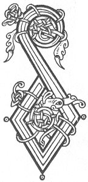

  
[Intangible Textual Heritage](../../../index) 
[Legends/Sagas](../../index)  [Celtic](../index)  [Carmina
Gadelica](../cg)  [Index](index)  [Previous](cg1072)  [Next](cg1074) 

------------------------------------------------------------------------

[Buy this Book at
Amazon.com](https://www.amazon.com/exec/obidos/ASIN/B0027P88YQ/internetsacredte)

------------------------------------------------------------------------

  
*Carmina Gadelica, Volume 1*, by Alexander Carmicheal, \[1900\], at
Intangible Textual Heritage

------------------------------------------------------------------------

 

<table data-border="0">
<colgroup>
<col style="width: 50%" />
<col style="width: 50%" />
</colgroup>
<tbody>
<tr class="odd">
<td data-valign="top" width="327">
p. 162
</td>
<td data-valign="top" width="327">
p. 163
</td>
</tr>
<tr class="even">
<td data-valign="top" width="327"><h3 id="la-chaluim-chille-69" data-align="center">LA CHALUIM-CHILLE [69]</h3></td>
<td data-valign="top" width="327"><h3 id="the-day-of-st-columba" data-align="center">THE DAY OF ST COLUMBA</h3></td>
</tr>
</tbody>
</table>

 

DIARDAOIN, Didaoirn--the day between the fasts--Thursday, was St
Columba's Day--Diardaoin Chaluim-chille, St Columba's Thursday--and
through him the day of many important events in the economy of the
people. It was a lucky day for all enterprises--for warping thread, for
beginning a pilgrimage, or any other undertaking. On Thursday eve the
mother of a family made a bere, rye, or oaten cake into which she put a
small silver coin. The cake was toasted before a fire of rowan, yew,
oak, or other sacred wood. On the morning of Thursday the father took a
keen-cutting knife and cut the cake into as many sections as there were
children in the family, all the sections being equal. All the pieces
were then placed in a 'ciosan'--a beehive basket--and each child
blindfold drew a piece of cake from the basket in name of the Father,
Son, and Spirit. The child who got the coin got the crop of lambs for
the year. This was called 'sealbh uan'--lamb luck. Sometimes it was
arranged that the person who got the coin got a certain number of the
lambs, and the others the rest of the lambs among them. Each child had a
separate mark, and there was much emulation as to who had most lambs,
the best lambs, and who took best care of the lambs.

Maunday Thursday is called in Uist 'Diardaoin a brochain,' Gruel
Thursday, and in Iona 'Diardaoin a brochain mhoir,' Great Gruel
Thursday. On this day people in maritime districts p. 163 made offerings of mead, ale, or gruel to the
god of the sea. As the day merged from Wednesday to Thursday a man
walked to the waist into the sea and poured out whatever offering had
been prepared, chanting:--

<table data-border="0">
<colgroup>
<col style="width: 50%" />
<col style="width: 50%" />
</colgroup>
<tbody>
<tr class="odd">
<td data-valign="top" width="327">
'A Dhe na mara, 
Cuir todhar ’s an tarruinn 
Chon tachair an talaimh, 
Chon bailcidh dhuinn biaidh.'
</td>
<td data-valign="top" width="327">
O God of the sea, 
Put weed in the drawing wave 
To enrich the ground, 
To shower on us food.
</td>
</tr>
</tbody>
</table>

Those behind the offerer took up the chant and wafted it along the
sea-shore on the midnight air, the darkness of night and the rolling of
the waves making the scene weird and impressive. In 1860 the writer
conversed in Iona with a middle-aged man whose father, when young, had
taken part in this ceremony. In Lewis the custom was continued till this
century. It shows the tolerant spirit of the Columban Church and the
tenacity of popular belief, that such a practice should have been in
vogue so recently.

The only exception to the luck of Thursday was when Beltane fell on that
day.

<table data-border="0">
<colgroup>
<col style="width: 50%" />
<col style="width: 50%" />
</colgroup>
<tbody>
<tr class="odd">
<td data-valign="top" width="327">
'’D uair is Ciadaoineach an t-Samhain 
Is iarganach fir an domhain, 
Ach ’s meirg is mathair dh’ an mhac bhaoth 
’D uair is Daorn dh’ an Bhealltain.'
</td>
<td data-valign="top" width="327">
When the Wednesday is Hallowmas 
Restless are the men of the universe; 
But woe the mother of the foolish son 
When Thursday is the Beltane.
</td>
</tr>
</tbody>
</table>

 

<table data-border="0">
<colgroup>
<col style="width: 25%" />
<col style="width: 25%" />
<col style="width: 25%" />
<col style="width: 25%" />
</colgroup>
<tbody>
<tr class="odd">
<td data-valign="top">
 
</td>
<td data-valign="top">
p. 162
</td>
<td data-valign="top">
 
</td>
<td data-valign="top">
p. 163
</td>
</tr>
<tr class="even">
<td data-valign="top">
 
</td>
<td data-valign="top">
DAORN Chalum-chille chaoimh 
La chur chaorach air seilbh, 
La chur ba air a laogh, 
La chur aodach an deilbh.

La chur churach air sal, 
La chur gais chon a meirgh, 
La chon breith, la chon bais, 
La chon ardu a sheilg.

La chur ghearran an eill, 
La chur feudail air raon, 
La chur urnuigh chon feum, 
La m’ eudail an Daorn. 
      La m’ eudail an Daorn.
</td>
<td data-valign="top">
 
</td>
<td data-valign="top">
THURSDAY of Columba benign, 
Day to send sheep on prosperity, 
Day to send cow on calf, 
Day to put the web in the warp.

Day to put coracle on the brine, 
Day to place the staff to the flag, 
Day to bear, day to die, 
Day to hunt the heights.

Day to put horses in harness, 
Day to send herds to pasture, 
Day to make prayer efficacious, 
Day of my beloved, the Thursday, 
      Day of my beloved, the Thursday.

 
</td>
</tr>
</tbody>
</table>

 

------------------------------------------------------------------------

[Next: 70 (notes). Genealogy of Bride. Sloinntireachd Bhride](cg1074)
